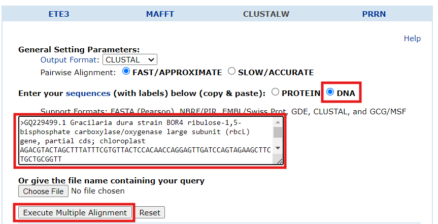
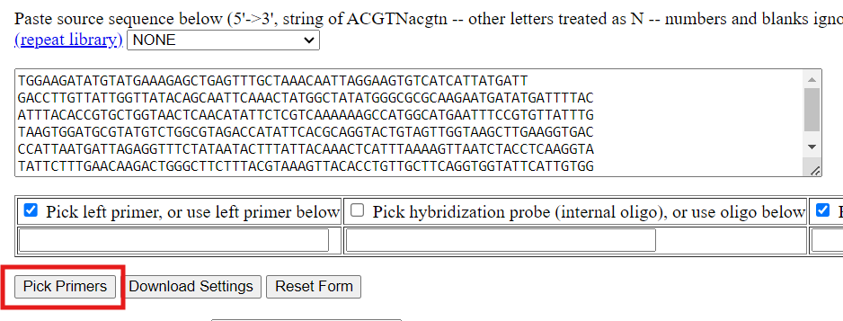

# Protocol for Designing Primers for Species Identification

This protocol provides a step-by-step guide to designing primers for identifying a specific species using conserved gene sequences. The process includes selecting a gene, retrieving and aligning sequences from related species, designing primers, and verifying their specificity.

In this case I worked on trying to identify a species of Gracilaria gracilis.

## Materials and Tools
- **Internet Access**
- **Text Editor** (e.g., Notepad, Word)
- **Bioinformatics Tools**:
  - [NCBI](https://www.ncbi.nlm.nih.gov/)
  - [ClustalW](https://www.genome.jp/tools-bin/clustalw)
  - [Primer3](https://primer3.ut.ee/)
  - [Primer-BLAST](https://www.ncbi.nlm.nih.gov/tools/primer-blast/)

## Steps

### Step 1: Selection of a Conserved Gene

1. **Choose a conserved gene** that is commonly used for species identification. Examples include:
   - **16S rRNA** for bacteria.
   - **rbcL** for plants.

   I chose the rbcL gene, and searched for *"red algae rbcL"* in NCBI.

### Step 2: Retrieval of Gene Sequences from NCBI

1. **Access the NCBI website**: [NCBI]([../images/ncb1%20(1).png](https://www.ncbi.nlm.nih.gov/)).
2. **Search for the target gene** in related species:
   - Type the species name and the gene name into the search bar (e.g., *Escherichia coli 16S rRNA* Or alternatively *bacteria 16S* if you don't know related species.).
   .png)
3. **Select the appropriate search result**.
4. **View and copy the nucleotide sequence**:
   - Click on the **FASTA** option to get the sequence.
   .png)
   - **Copy the sequence** and save it into a text editor.
   .png)
5. **Repeat this process** to obtain sequences for at least three species closely related to the species you are interested in identifying.

### Step 3: Multiple Sequence Alignment Using ClustalW

1. **Visit the ClustalW website**: [ClustalW](https://www.genome.jp/tools-bin/clustalw).
2. **Prepare for alignment**:
   - Copy the sequences, including their titles, into the "Enter your sequences" window.
3. **Set the sequence type** to DNA.
4. **Execute the alignment** by clicking "Execute Multiple Alignment".

5. **Save the alignment result** to a text editor for further analysis.
.png)

### Step 4: Selection of Regions for Primer Design

1. **Review the alignment**:
   - Look for two regions with a **high degree of similarity (indicated by `*`)** among the species, each spanning more than 20 nucleotides.
   - Ensure there is a **variable region** between these conserved regions that will help differentiate your target species.
   - If the criteria are not met, consider **choosing a different gene** or adding more related species to the alignment.

### Step 5: Primer Design Using Primer3

1. **Navigate to the Primer3 website**: [Primer3](https://primer3.ut.ee/).
2. **Input the chosen sequence**:
   - Paste the aligned sequence from the text editor into the "Paste source sequence below" window.
   
3. **Design the primers**:
   - Click "Pick Primers" to generate possible primer pairs.
   
   - Primer3 will list several pairs, with the top pair usually being the most suitable.

In this case:
   

| Primer Type      | Sequence                |
|------------------|-------------------------------------|
| **Forward Primer** | ATGCGTATGTCTGGCTAGA                |
| **Reverse Primer** | GAAGCCCAGTCTTGTTCAAAGA             |

### Step 6: Verification of Primer Specificity with Primer-BLAST

1. **Access Primer-BLAST**: [Primer-BLAST](https://www.ncbi.nlm.nih.gov/tools/primer-blast/).
2. **Enter the primer sequences** designed by Primer3.

3. **Select the target species category** to ensure the primers' specificity to your species of interest.
.png)
4. **Run the analysis** to check that the primers bind specifically to one region in the genome, avoiding non-target regions.

## Conclusion

The primers you design should amplify a conserved region in the genome that is specific to the target species. The amplified sequence will be used to identify and differentiate the species from closely related ones based on the variable region between the conserved sequences.

## Notes
- **Save all sequences and alignment data** for future reference.
- **Adjust Primer3 and Primer-BLAST settings** as necessary based on experimental needs and species-specific requirements.
