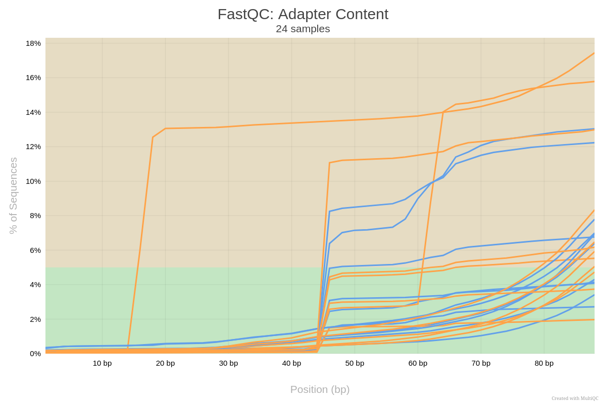
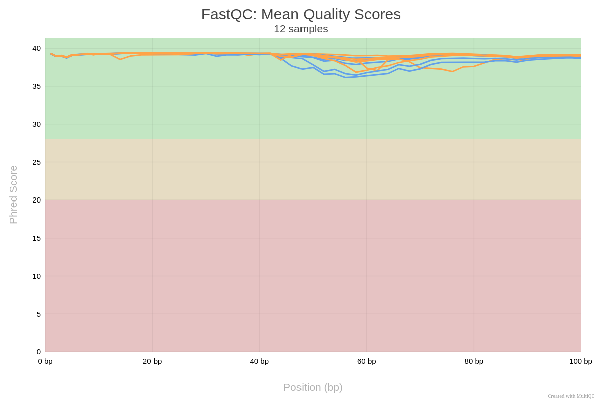
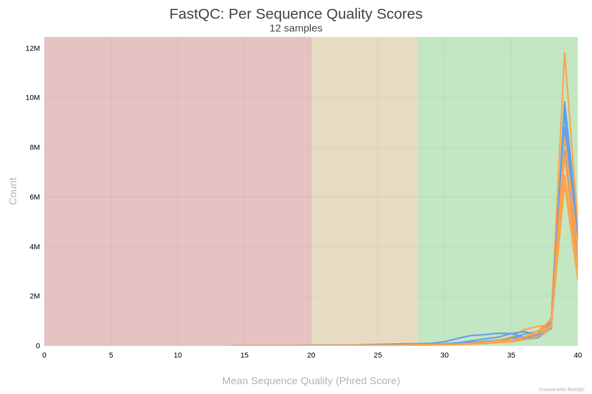
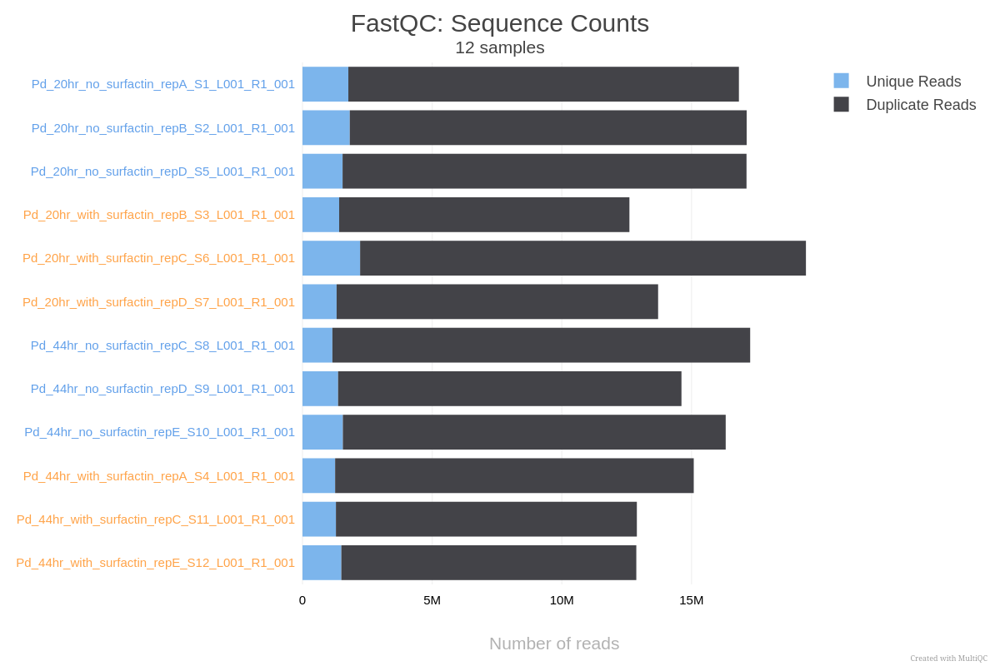

# Quality Check Protocol for Tiling Libraries - FastQC and MultiQC

## General Actions:

### 1. Activate Conda
Activate your Conda environment by running the following command:

```bash
source /usr/local/miniconda3/bin/activate
```
### 2. Setting the Path
```bash
conda activate your_environment_name
```
```bash
which toolName 
#for example 'fastqc'
#This will display the path to the fastqc command.
```
```bash
conda info --envs
#optional
#This will list all available Conda environments.
```
```bash 
export PATH=/home/user/miniconda3/envs/bioinf/bin:$PATH                     
#Set the PATH temporarily
```
```bash
echo 'export PATH=/home/user/miniconda3/envs/bioinf/bin:$PATH' >> ~/.bashrc
#Set the PATH permanently
```
## 3. FastQC
```bash 
cd /path/to/your/files
#Change to the directory where your files are stored.
```


```bash 
find /path/to/root_directory -name "*.fastq.gz" -exec fastqc {} \;
#run the tool
#This will generate relevant output files (e.g., .zip, .gz, and .html files) next to each raw data file.
```
### 4. Running MultiQC on FastQC Reports:

```bash 
cd /path/to/your/fastqc/reports
#Navigate to the directory containing the FastQC output files
```
```bash 
multiqc .
#run multiqc on current directory
```
```bash 
multiqc /path/to/your/fastqc/reports
#Alternatively, you can specify the path to the FastQC reports. this is just another way to do it.
```
### Results








** all results can be shown on my user in the station: home>RNA_seq>results

# Using a script combining fastqc & multiqc
Instead of running each tool separately, you can use a code that combines the two operations like this:
 

  
Modify the paths in the script to match your directories before running it.  

## Script  

```bash
#!/bin/bash

# Specify paths. use the pwd command to copy complete pathway!
input_dir="/path/to/your/fastq_files"  # Change this to your directory containing input files
fastqc_output_dir="/path/to/your/fastqc_results"  # Change this to where you want FastQC results saved
multiqc_output_dir="/path/to/your/multiqc_results"  # Change this to where you want MultiQC results saved

# Create output directories if they don't exist
mkdir -p "$fastqc_output_dir"
mkdir -p "$multiqc_output_dir"

# Run FastQC on all .fastq_trimming_report.txt files and save results in the specified output directory
fastqc "$input_dir"/*.fq -o "$fastqc_output_dir"

# Run MultiQC on the FastQC results and save the final report in the specified MultiQC output directory
multiqc "$fastqc_output_dir" -o "$multiqc_output_dir"

echo "FastQC and MultiQC analysis completed!"
