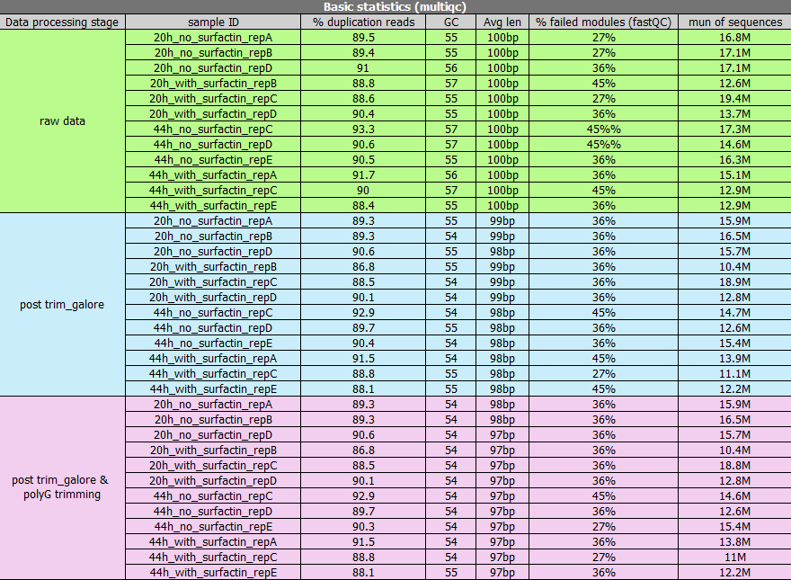
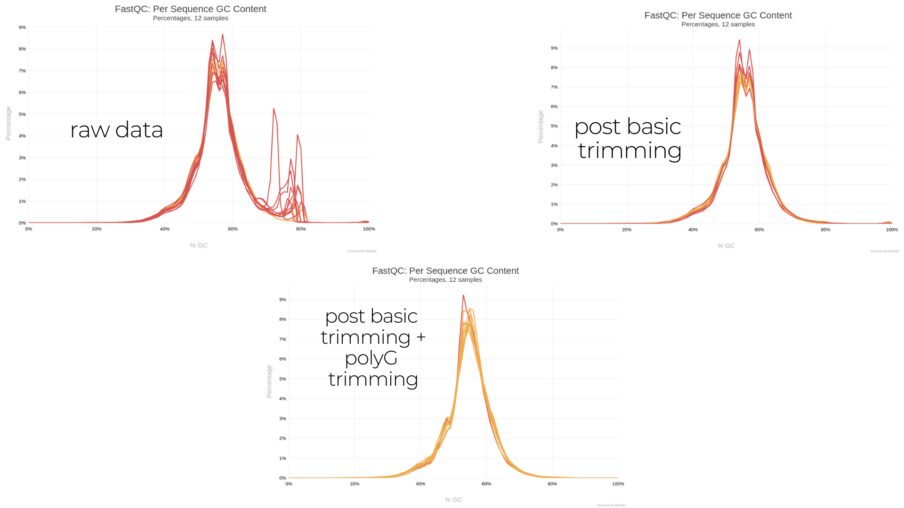
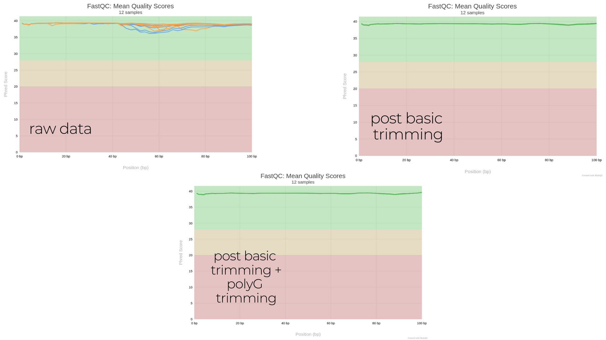
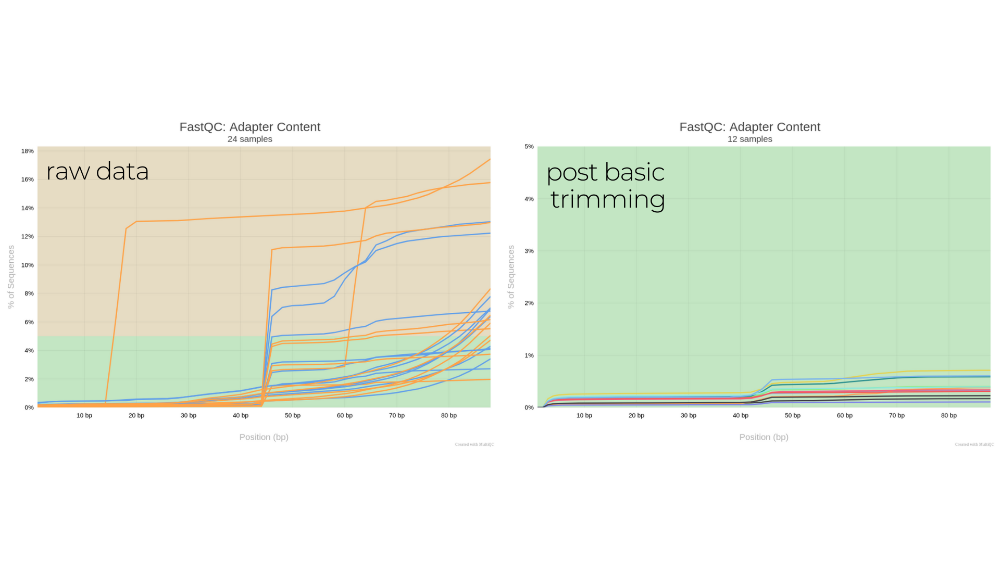

# Comparison of Data Quality Processing Steps

## Overview
This protocol outlines the comparison of FastQC and MultiQC reports before and after quality improvement steps. The trimming was performed using **Trim Galore v0.6.10**, and the data quality assessments were conducted using **FastQC v0.12.1** and **MultiQC v1.27.1**.

### Data Processing Stages
The comparison was made across three stages:
1. **Raw Data** – Unprocessed sequencing reads.
2. **Trimmed Data** – Processed using Trim Galore to:
   - Remove adapter sequences.
   - Remove bases with low quality.
   - Discard reads shorter than 70 bp.
3. **Final Processed Data** – Additional step to remove **poly-G** sequences.

## Quality Improvement Pipeline

### **Required Software**
- [Trim Galore](https://www.bioinformatics.babraham.ac.uk/projects/trim_galore/) v0.6.10
- [FastQC](https://www.bioinformatics.babraham.ac.uk/projects/fastqc/) v0.12.1
- [MultiQC](https://multiqc.info/) v1.27.1

### **Execution Script**
```bash
#!/bin/bash

# Define input and output directories (use 'pwd' to get absolute paths)
input_dir="/complete/path/to/fastq_files"
output_dir="/complete/path/to/new/directory/trim_res"
output_dir_2="/complete/path/to/new/directory/trim_res_polyG"

# Create output directories if they do not exist
mkdir -p "$output_dir"
mkdir -p "$output_dir_2"

# Step 1: Trim adapters and remove reads <70bp
for file in "$input_dir"/*.fastq; do
    trim_galore --length 70 "$file" -o "$output_dir"
done

# Step 2: Trim poly-G sequences
for file in "$output_dir"/*_trimmed.fq; do
    trim_galore --nextseq 20 "$file" -o "$output_dir_2"
done

echo "Trimming complete!"
```

## **Results**

### **1. Summary Table of Basic Statistics**


### **2. GC Content Comparison**


After polyG trimming, the double peak is no longer present, suggesting that the additional peak may have been an artifact of Illumina sequencing, where polyG tails are added to low-quality sequence ends. If this is the case, the extra peak is likely a technical issue rather than a biological feature.

If the double peak were caused by contamination, polyG trimming would not have removed it, since the peak would result from differences in GC content rather than polyG sequences

### **3. Mean Quality Score Differences**


It can be seen that the basic trimming improved the quality of the sequences. There is no change, and we do not expect to see any change, after further trimming of polyG.

### **4. Adapter Content Across Processing Stages**

It can be seen that there has been a significant improvement in the percentage of adapters in all examples.
 *Trim Galore + PolyG trimming*,has no image since no sequences had adapter contamination higher than 0.1%.

