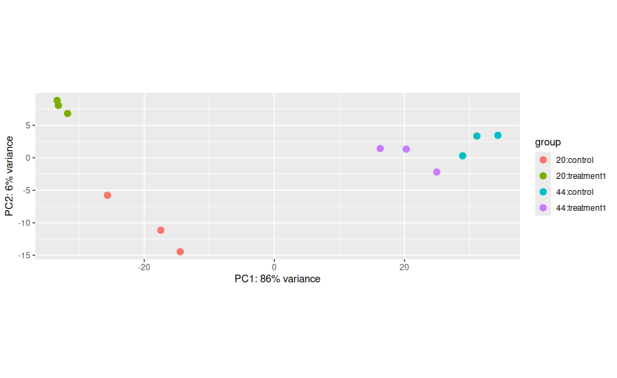
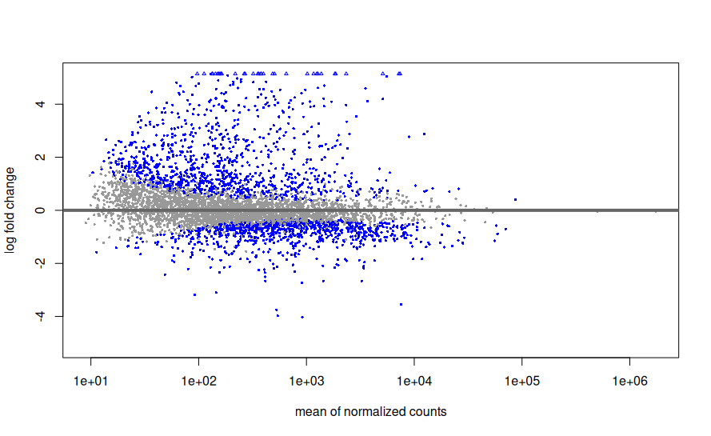
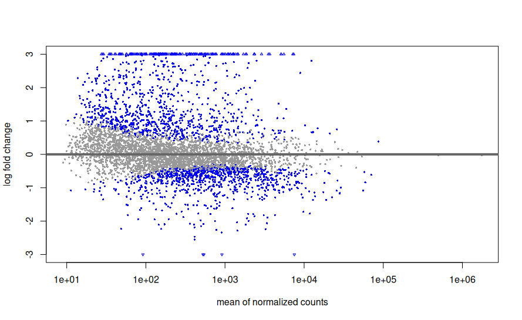
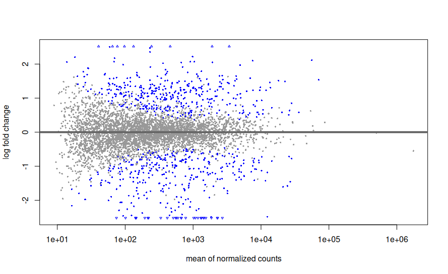
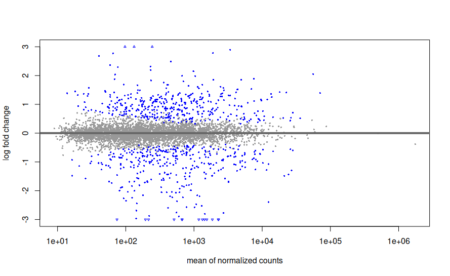
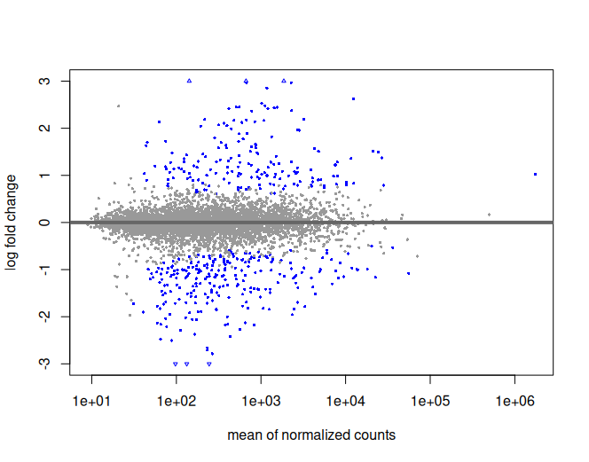
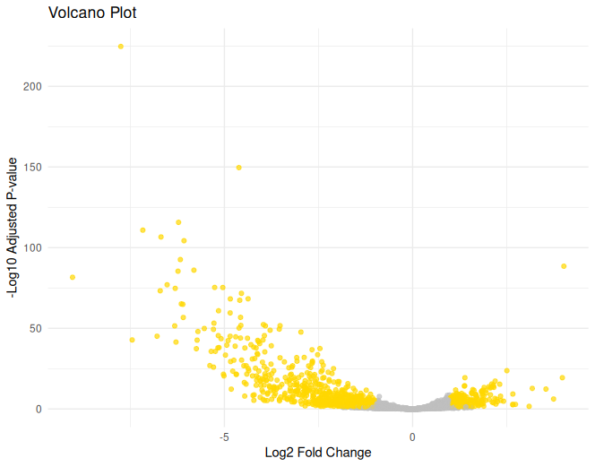
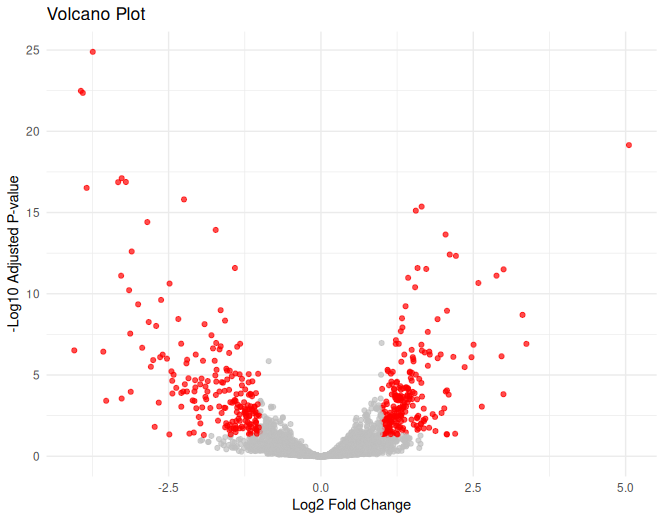
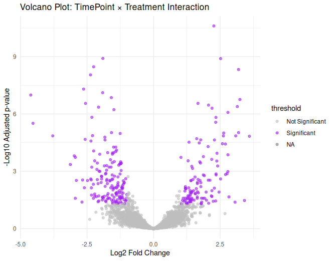

# RNA-Seq Differential Expression Analysis with DESeq2
For this stage i used R studios.
## 1. Set Working Directory and Load Data

First, set the working directory and load the count and metadata files.

```r
# Set working directory
setwd("~/path/to/deseq2/input/directory")

# Load count data (Counts.csv)
f_counts <- "/path/to/deseq2/input/directory/Counts.csv"
counts1 <- read.csv(f_counts, sep = ",", stringsAsFactors = FALSE, header = TRUE, row.names = 1)

# Load metadata (metadata.csv)
f_design <- "/path/to/deseq2/input/directory/metadata.csv"
design1 <- read.csv(f_design, sep = ",", stringsAsFactors = FALSE, header = TRUE, row.names = 1)
```
## 2. Sometimes you need to Remove "GeneID" as a column from Counts
you need to make sure the rows of the factors in the metadata file (TimePint & Treatment) match the columns in the counts file. these will be the names of your samples. additionally, they should appear in the **same order**.

in order for the to match, the GeneID columns must be removed from the counts file (i also think you can not give this column a name from the getgo but i havent checked it)

*not always neccesry
```r
# removefirst column in counts. if your geneID column isnt the first one, adust the code

counts3 = counts3[, -1]
```


## 3. Ensure Columns Match Rows and Convert Strings to Factors
you need to make sure the rows of the factors in the metadata file (TimePint & Treatment) match the columns in the counts file. these will be the names of your samples. additionally, they should appear in the **same order**.

Ensure that the columns in the count data and rows in the metadata match. Convert metadata variables to factors, as DESeq2 requires factors, not strings, for experimental design.

```r
colnames(counts1) #check column names of counts1
rownames(design1) #check row names of design1 (the metadata)
colnames(counts1) <- rownames(design1) # make colnames as rownames
identical(colnames(counts1), rownames(design1)) # check if identical

#should return TRUE if both match and are in the same order
#design1->my metadata, counts1-> my counts
all(rownames(design1) == colnames(counts1)) # check if identical
```
## 4. convert metadata file (design1) from string type to factor
deseq know to work with factors and not string.
```r
#Convert metadata (in my case - design1) to factors
colData <- as.data.frame(apply(design1, c(1, 2), as.factor))
```
## 5. Create Model Matrix (optional)
Sometimes, people create a model matrix to check how their design is structured before running DESeq2, i.e. how we divide the data (in this case by time points and with and without surfactant treatment). In our case, this step is just to make sure that the system knows our factors, and is **not mandatory**.

```r
# Create model matrix for experimental design
modelMatrixTest <- as.data.frame(model.matrix(~ treatment + TimePoint, data = colData))

# View model matrix
View(modelMatrixTest)

```

## 6. Filter Genes with Low Counts
Filter out genes with low counts, retaining only those with a count greater than 5 in at least 10 samples. It will go through each row (which represents a gene, in this case) and if at least two samples (10/12) have a read count higher than 5, the gene will be kept. If there are not at least two such samples - the gene will be filtered out.

```r
# Filter genes with low counts 
keep = rowSums(counts1 > 5) >= 10
counts3 = counts1[keep, ]
```

## 7. Create DESeqDataSet
Create a DESeqDataSet object that contains the count data, the metadata, and the experimental design. this dataset combines everything deseq2 needs, and we will run deseq2 on this dataset.

```r
# Load DESeq2 (and make sure its installed)
library(DESeq2)

# Create DESeqDataSet
dds = DESeqDataSetFromMatrix(
  countData = counts3,   # Use filtered count data
  colData = colData,     # Metadata
  design = ~ TimePoint*Treatment   # each parameter compered within and interaction
)
```
## 8. Set Reference Level for Treatment
DESeq2 compares gene expression between groups, and it needs to know which group is the "baseline" for comparisons. This is called the reference level.
in my case, the 'control' (no surfactin treatment) will be that baseline.

```r
# Check current levels of 'treatment'. should be the name of the chosen column in the metadata file (colData).
levels(dds$Treatment)

# Set 'control' as the reference level
dds$treatment <- relevel(dds$Treatment, ref = "control")
```
 ## 9. Initial PCA to Check Data
Perform an initial Principal Component Analysis (PCA) to visualize variation in the data and check for batch effects or outliers.

✅ Good sign: Samples cluster by treatment (e.g., "Social" and "Isolated" separate).                                                             
❌ Bad sign: Samples cluster by something unrelated (e.g., sequencing date).

PCA helps us spot issues early before running DESeq2.

```r
# Stats
vcd <- vst(dds, blind = FALSE) # VST normalization
plotPCA(vcd, intgroup = c("TimePoint","Treatment")) # PCA
```




## 10. Run DESeq2
Run DESeq2 to perform differential expression analysis.
```r
# Run DESeq2 analysis
dds <- DESeq(dds)
```
## 11. Viewing comparisons made and setting variables for each comparison
```r
resultsNames(dds) #shows you the comparisons deseq made
compare1 <- resultsNames(dds)[2] # Variable assignment of TimePoint comparison
compare2 <- resultsNames(dds)[3] #Variable assignment of Surfactin treatment comparison
```
## Now we will work on each comparison seperatlly 
even though it the exact same code

## TimePoint (compare1) -------------------------------------
### A. show results
```r
res <- results(dds, name=compare1)
head(res, 2) # just to see how it looks like

# Explanation
mcols(res, use.names = T)
expl <- mcols(res, use.names = T)
```
### B. Save the results
at this point its recommended to save your results:
```r
# Save
summary(res)
write.table(res,
            file = "DE Timepoint.csv",
            sep = ",",
            row.names = T,
            quote = F)
```
### C. AM plot
An MA plot visualizes the differences in gene expression between two conditions.

X-axis (A) = Average expression of a gene across both samples (in log scale).
→ Genes with higher expression overall are farther to the **right**.

Y-axis (M) = Log2 fold change (log₂FC) between the two conditions.
→ Genes above 0 are upregulated, and genes below 0 are downregulated (compared to the reference).

####  What is Log₂ Fold Change?

**Log₂ fold change** is a way to describe how much a gene's expression changes between two conditions, like treatment vs. control.


1. **Fold change** is the ratio of expression between two conditions: 

    Fold change = Expression in Treatment / Expression in Control

2. We then take the **log base 2** of this ratio to get the **log₂ fold change**.
 
 3. example:


    If a gene is expressed **twice as much** in treatment:
    → Fold change = 2
    → log₂(2) = +1

    If a gene is expressed **half as much** in treatment:
    → Fold change = 0.5
    → log₂(0.5) = -1


```r
# Plot
plotMA(res)
```


When measuring gene expression differences between conditions, we often use **log2 fold change (LFC)** to show how much a gene's expression increases or decreases.

However, **genes with low counts** can show **misleadingly high LFC values**. Shrinkage helps make these results more reliable.

---

#### 🧪 Example: Two Genes with the Same Fold Change

| Condition | Gene A (low count) | Gene B (high count) |
|-----------|--------------------|----------------------|
| Control   | 2 counts           | 1,000 counts         |
| Treatment | 4 counts           | 2,000 counts         |

####  Step 1: Fold Change

- **Gene A**: 4 / 2 = 2-fold
- **Gene B**: 2000 / 1000 = 2-fold

####  Step 2: Log2 Fold Change

- **Gene A**: `log2(4/2) = log2(2) = +1`
- **Gene B**: `log2(2000/1000) = log2(2) = +1`

So both seem to have **+1 log2 fold change**.

---

#### ⚠️ What's the Problem?

- **Gene A** has very low counts (2 → 4)
  - This change could be **random noise**.
  - The LFC is **unreliable**.
- **Gene B** has high counts (1000 → 2000)
  - This change is **statistically stable** and trustworthy.

---

#### 🧽 What Shrinkage Does

Shrinkage (like `lfcShrink()` in DESeq2) **pulls unreliable log fold changes closer to 0** when counts are low:

- **Gene A** might shrink from `+1 → +0.2`
- **Gene B** stays around `+1`

This makes the MA plot and downstream analysis more robust.

---
shrink with the following code:

```r
resLFC <- lfcShrink(dds, coef = compare1,
                    type = "apeglm")
plotMA(resLFC, ylim=c(-3,3))
plotMA(resLFC)
```
the reference is according to what you set when you created the dateset or according to the deseq default. To know what the reference is, if you are not sure, you need to run the following code, it will give you a list of the two parameters being compared, with the first being the reference.

```r
# Reference of MA plot
levels(dds$TimePoint)
```
In this case the reference is 20 hourns, and the plot looks like this:



and after shrinking like this:




### Top gene
These lines of code will reveal the gene whose expression level changes most significantly (lowest adj p value) between the two conditions (here between two time points, 20 and 44 hours):

```r
top_gene <- which.min(res$padj)
plotCounts(dds, gene = top_gene, intgroup = "TimePoint")
```


You can also build a plot from the same data that displays it differently (divided by treatments) like this:

```r
#same plot (top gene), more nice

library(ggplot2)
install.packages("ggplot2")

geneCounts = plotCounts(dds, gene = top_gene, intgroup = c("TimePoint", "Treatment"), returnData = TRUE)
ggplot(geneCounts, aes(x=Treatment, y=count, color=TimePoint))+geom_point(size = 6, position=position_jitter(w=0.1,h=0))+ggtitle(paste('Normolize Counts for', rownames(dds[top_gene])))
```


## Treatment (compare2) -------------------------------------
Let's do the same fot treatment (with and without surfactin)
this is the whole code:

```r
# Res for Treatment ----
res <- results(dds, name=compare2)
head(res, 2)

# Explanation
mcols(res, use.names = T)
expl <- mcols(res, use.names = T)

# Save
summary(res)
write.table(res,
            file = "DE Treatment.csv",
            sep = ",",
            row.names = T,
            quote = F)

# Plot
plotMA(res)

resLFC <- lfcShrink(dds, coef = compare2,
                    type = "apeglm")
plotMA(resLFC, ylim=c(-3,3))
plotMA(resLFC)

# Top Genes
top_gene <- which.min(res$padj)
plotCounts(dds, gene = top_gene, intgroup = "Treatment")

#same plot (top gene), more nice

geneCounts = plotCounts(dds, gene = top_gene, intgroup = c("TimePoint", "Treatment"), returnData = TRUE)
ggplot(geneCounts, aes(x=Treatment, y=count, color=Treatment))+geom_point(size = 6, position=position_jitter(w=0.1,h=0))+ggtitle(paste('Normolize Counts for', rownames(dds[top_gene])))
```
and the results are:
AM plot compering treatment to control (reference)

shrinked MAplot


## Interaction (compare2) -------------------------------------
Here we are comparing the effect of the treatment (surfactin) at 20 hours to its effect at 44 hours. the 20 hours will be the baseline. 

the qustion - *“Is the difference between Control and Treated at 44h different from the difference at 20h?”*

#### Concept

1. At each time point, you compute the log2 fold change (log2FC) between treatment and control.

2. Then, you subtract the log2FCs between time points to get the interaction effect.

#### Example


We have two time points: **20 hours** and **44 hours**.  
We want to see **how the effect of treatment changes** between these time points.

#### 🧬 Expression values

| Time Point | Condition | Expression |
|------------|-----------|------------|
| 20h        | Treated   | 120        |
| 20h        | Control   | 100        |
| 44h        | Treated   | 180        |
| 44h        | Control   | 100        |

---

**At 20h:**

- Ratio = 120 / 100 = 1.2  
- `log2(1.2) ≈ 0.263`

**At 44h:**

- Ratio = 180 / 100 = 1.8  
- `log2(1.8) ≈ 0.847`

---

Interaction log2FC = log2FC_44h - log2FC_20h = 0.847 - 0.263 = 0.584

that for the Y axis.

For the x axis - the average is calculated across all four conditions.


```r
# Res for interaction ---------------------------------------------------------
res <- results(dds, name=compare3)
head(res, 2)

# Explanation
mcols(res, use.names = T)
expl <- mcols(res, use.names = T)

# Save
summary(res)
write.table(res,
            file = "DE Timepoint.csv",
            sep = ",",
            row.names = T,
            quote = F)

# Plot
plotMA(res)

resLFC <- lfcShrink(dds, coef = compare3,
                    type = "apeglm")
plotMA(resLFC, ylim=c(-3,3))
```
and the results are:

AM plot compering treatment to control (reference)


shrinked MAplot



## VST Transformation

Count data tends to have high variability: genes with low counts often have very large variances, while genes with high counts usually have lower variability.

The goal of VST is to make the data more suitable for downstream analyses like PCA or clustering.

VST transforms the count data so that the variance (spread of the data) is no longer dependent on the mean (the average expression level). This means that, after applying VST, genes with both high and low expression will have similar variability, making them easier to compare.

**Note**: we already did this transformation hen we initialy checked the data in a PCA plot (we called it vcd).


### NMDS plot
Non-metric Multidimensional Scaling (NMDS) is a method used to visualize the similarity or dissimilarity between samples. It takes complex, high-dimensional data and reduces it to a 2D or 3D plot where similar samples appear close together and different ones are farther apart.

NMDS is especially useful when your data is not normally distributed (which is often the case with gene expression) and when you want to visualize group patterns or treatment effects without making strong assumptions about the data.

- k: The number of dimensions the data is reduced to (usually 2 for a flat plot). A higher k may give a better fit but is harder to visualize.

- Stress: A number that tells us how well the NMDS plot represents the true distances between samples. Lower stress means better representation.

    - Stress < 0.2 = good

    - Stress > 0.3 = poor fit

```r
###### NMDS PLOT ######

#install package
install.packages("vegan")
library(vegan)

#install ggplot
install.packages("ggplot2", dependencies = TRUE)
library(ggplot2)

#prepare the transfotmed (vst) data into assay 
vst_counts <- assay (vcd)

#Use bray curtis distances
dist1 = "bray"

#run NMDS
nmds1 = metaMDS(t(vst_counts),k=2,dist=dist1, try=1000)

#create distance matrix for PERMANOVA
bray_dist <- vegdist(t(vst_counts), method=dist1)

#preform PERMANOVA with adonis2 
adonis_res <- adonis2(bray_dist ~ TimePoint * Treatment, data = as.data.frame(colData))
r2 <- round(adonis_res$R2[1], 3)
pval <- adonis_res$`Pr(>F)`[1]

# Data for NMDS plot
df_nmds1 <- as.data.frame(nmds1$points)
df_nmds1$names <- rownames(nmds1$points)
df_nmds1$TimePoint <- colData$TimePoint
df_nmds1$Treatment <- colData$Treatment

# Plot NMDS with stress and PERMANOVA result
ggplot(df_nmds1, aes(x = MDS1, y = MDS2, color = Treatment, shape = TimePoint)) +
  geom_point(size = 6) +
  ggtitle(paste0("VST NMDS; distance = ", dist1,
                 ", stress = ", round(nmds1$stress, 2),
                 "\nPERMANOVA R² = ", r2, ", p = ", pval))


```

.png)

**Note** - one conclusion to draw from the NMDS plot is that we need more repeats. there is no way to tell whether there is a difference in the 44hr between treatment and control. 

* its also woth checking whether there is surfactin left after 44 hours (lc-ms or maldi)

## Volcano Plot


### Axes of a Volcano Plot

- **X-axis**: Represents the **log2 fold change (LFC)** between two conditions. It measures the magnitude of gene expression change:
  - Positive values: Upregulated genes in the experimental group (e.g., treatment vs. control).
  - Negative values: Downregulated genes in the experimental group.

- **Y-axis**: Represents the **-log10(p-value)**, which indicates the statistical significance of the gene expression change. Higher values represent more significant changes:
  - High values on the y-axis: Genes that are statistically significant.
  - Low values on the y-axis: Genes with no significant change (p-value is large).

### How is the Volcano Plot Calculated?

1. **Log2 fold change**: This is the difference in gene expression between two conditions, typically calculated as:
   - `log2(fold change)` = log2(Condition A / Condition B)
     - If the gene is upregulated in Condition A compared to Condition B, the fold change is positive.
     - If downregulated, the fold change is negative.

2. **p-value**: This represents the statistical significance of the observed change. Typically, a t-test or a similar statistical test is used to compute the p-value.

3. **-log10(p-value)**: The p-value is transformed to make the plot easier to read and highlight significant changes. Larger p-values (less significant) are represented by smaller values on the y-axis, and smaller p-values (more significant) are represented by larger values.

### Example of a Volcano Plot Calculation

Let's say we have the following data for a gene:

| Gene     | Treatment | Control | p-value   |
|----------|------------------------|------------------------|-----------|
| Gene 1   | 200                    | 50                     | 0.001     |
| Gene 2   | 100                    | 100                    | 0.2       |
| Gene 3   | 150                    | 75                     | 0.05      |

1. **Gene 1**:
   - Fold change: `200 / 50 = 4` → log2(4) = 2 (upregulated)
   - p-value = 0.001 → -log10(0.001) = 3 (highly significant)

2. **Gene 2**:
   - Fold change: `100 / 100 = 1` → log2(1) = 0 (no change)
   - p-value = 0.2 → -log10(0.2) = 0.7 (not significant)

3. **Gene 3**:
   - Fold change: `150 / 75 = 2` → log2(2) = 1 (upregulated)
   - p-value = 0.05 → -log10(0.05) = 1.3 (significant)

### How to Read the Plot

1. **Genes on the left** (negative log2 fold change): These genes are downregulated in the experimental group (e.g., treatment vs. control).
2. **Genes on the right** (positive log2 fold change): These genes are upregulated in the experimental group.
3. **High y-values** (top of the plot): Genes that are statistically significant (low p-values).
4. **Genes far from the origin (either left or right)** are the ones with the largest changes in expression, and the more statistically significant they are, the higher they will be on the y-axis.

### Code
```r
#___________________volcano plot treatment___________________________#

# Load necessary libraries
library(ggplot2)
library(DESeq2)

res = results(dds, contrast = c("Treatment", "treatment1", "control"))

# Create a volcano plot
ggplot(res, aes(x = log2FoldChange, y = -log10(padj))) +
  geom_point(aes(color = padj < 0.05 & abs(log2FoldChange) > 1), alpha = 0.7) +
  scale_color_manual(values = c("gray", "red")) +
  labs(title = "Volcano Plot", x = "Log2 Fold Change", y = "-Log10 Adjusted P-value") +
  theme_minimal() +
  theme(legend.position = "none")

#___________________volcano plot timepoint___________________________#

# Load necessary libraries
library(ggplot2)
library(DESeq2)

# Run DESeq2 (already done) and extract results
# Assuming 'dds' is your DESeqDataSet
res = results(dds, contrast = c("TimePoint", "20", "44"))

# Create a volcano plot
ggplot(res, aes(x = log2FoldChange, y = -log10(padj))) +
  geom_point(aes(color = padj < 0.05 & abs(log2FoldChange) > 1), alpha = 0.7) +
  scale_color_manual(values = c("gray", "gold")) +
  labs(title = "Volcano Plot", x = "Log2 Fold Change", y = "-Log10 Adjusted P-value") +
  theme_minimal() +
  theme(legend.position = "none")

#_______________ volcano plot interaction ___________________________#

res_interaction <- results(dds, name = resultsNames(dds)[4])

# Load necessary libraries
library(ggplot2)
library(DESeq2)

# Add a column to indicate significance
res_interaction$threshold <- as.factor(
  ifelse(res_interaction$padj < 0.05 & abs(res_interaction$log2FoldChange) > 1, "Significant", "Not Significant")
)

# Convert to data frame for ggplot
res_df <- as.data.frame(res_interaction)

# Volcano plot
ggplot(res_df, aes(x = log2FoldChange, y = -log10(padj), color = threshold)) +
  geom_point(alpha = 0.6, size = 1.5) +
  scale_color_manual(values = c("grey", "purple")) +
  theme_minimal() +
  labs(title = "Volcano Plot: TimePoint × Treatment Interaction",
       x = "Log2 Fold Change",
       y = "-Log10 Adjusted p-value")
```


### Results
Time point (20hr reference):


Treatment (control reference):


Interaction:




