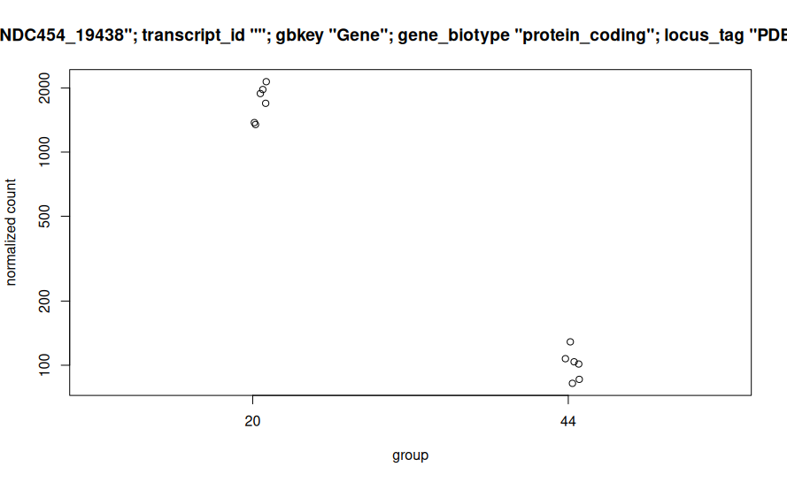
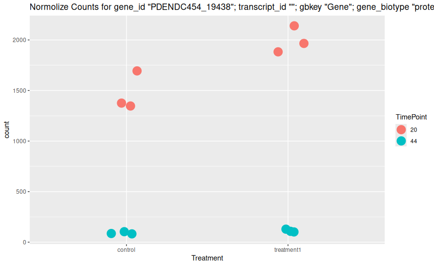
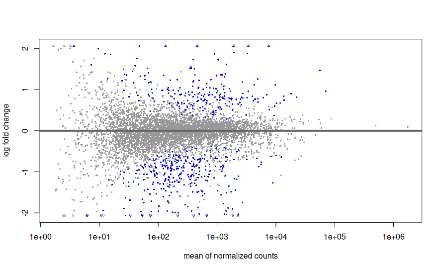
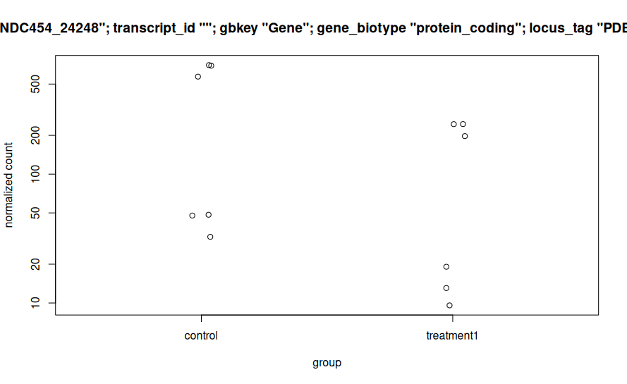
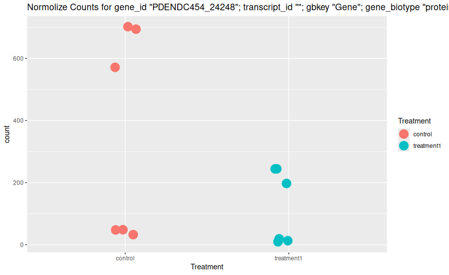
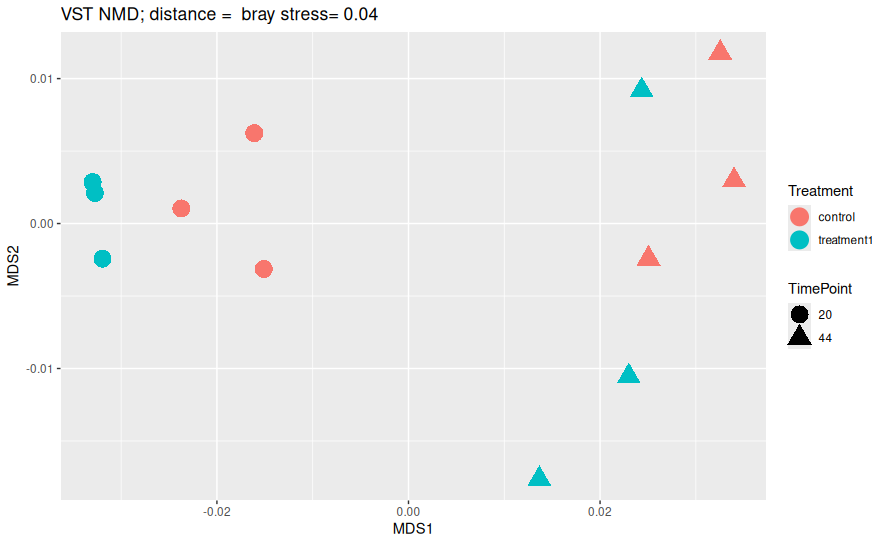

# RNA-Seq Differential Expression Analysis with DESeq2
For this stage i used R studios.
## 1. Set Working Directory and Load Data

First, set the working directory and load the count and metadata files.

```r
# Set working directory
setwd("~/path/to/deseq2/input/directory")

# Load count data (Counts.csv)
f_counts <- "/path/to/deseq2/input/directory/Counts.csv"
counts1 <- read.csv(f_counts, sep = ",", stringsAsFactors = FALSE, header = TRUE, row.names = 1)

# Load metadata (metadata.csv)
f_design <- "/path/to/deseq2/input/directory/metadata.csv"
design1 <- read.csv(f_design, sep = ",", stringsAsFactors = FALSE, header = TRUE, row.names = 1)
```
## 2. Sometimes you need to Remove "GeneID" as a column from Counts
you need to make sure the rows of the factors in the metadata file (TimePint & Treatment) match the columns in the counts file. these will be the names of your samples. additionally, they should appear in the **same order**.

in order for the to match, the GeneID columns must be removed from the counts file (i also think you can not give this column a name from the getgo but i havent checked it)

```r
# removefirst column in counts. if your geneID column isnt the first one, adust the code

counts3 = counts3[, -1]
```


## 3. Ensure Columns Match Rows and Convert Strings to Factors
you need to make sure the rows of the factors in the metadata file (TimePint & Treatment) match the columns in the counts file. these will be the names of your samples. additionally, they should appear in the **same order**.

Ensure that the columns in the count data and rows in the metadata match. Convert metadata variables to factors, as DESeq2 requires factors, not strings, for experimental design.

```r
colnames(counts1) #check column names of counts1
rownames(design1) #check row names of design1 (the metadata)
colnames(counts1) <- rownames(design1) # make colnames as rownames
identical(colnames(counts1), rownames(design1)) # check if identical

#should return TRUE if both match and are in the same order
#design1->my metadata, counts1-> my counts
all(rownames(design1) == colnames(counts1)) # check if identical
```
## 4. convert metadata file (design1) from string type to factor
deseq know to work with factors and not string.
```r
#Convert metadata (in my case - design1) to factors
colData <- as.data.frame(apply(design1, c(1, 2), as.factor))
```
## 5. Create Model Matrix (optional)
Sometimes, people create a model matrix to check how their design is structured before running DESeq2, i.e. how we divide the data (in this case by time points and with and without surfactant treatment). In our case, this step is just to make sure that the system knows our factors, and is **not mandatory**.

```r
# Create model matrix for experimental design
modelMatrixTest <- as.data.frame(model.matrix(~ treatment + TimePoint, data = colData))

# View model matrix
View(modelMatrixTest)

```

## 6. Filter Genes with Low Counts
Filter out genes with low counts, retaining only those with a count greater than 5 in at least 2 samples. It will go through each row (which represents a gene, in this case) and if at least two samples (2/12) have a read count higher than 5, the gene will be kept. If there are not at least two such samples - the gene will be filtered out.

```r
# Filter genes with low counts 
keep = rowSums(counts1 > 5) >= 2
counts3 = counts1[keep, ]
```

## 7. Create DESeqDataSet
Create a DESeqDataSet object that contains the count data, the metadata, and the experimental design. this dataset combines everything deseq2 needs, and we will run deseq2 on this dataset.

```r
# Load DESeq2 (and make sure its installed)
library(DESeq2)

# Create DESeqDataSet
dds = DESeqDataSetFromMatrix(
  countData = counts3,   # Use filtered count data
  colData = colData,     # Metadata
  design = ~ TimePoint + Treatment   # Experimental design formula (your factors)
)
```
## 8. Set Reference Level for Treatment
DESeq2 compares gene expression between groups, and it needs to know which group is the "baseline" for comparisons. This is called the reference level.
in my case, the 'control' (no surfactin treatment) will be that baseline.

```r
# Check current levels of 'treatment'. should be the name of the chosen column in the metadata file (colData).
levels(dds$Treatment)

# Set 'control' as the reference level
dds$treatment <- relevel(dds$Treatment, ref = "control")
```
 ## 9. Initial PCA to Check Data
Perform an initial Principal Component Analysis (PCA) to visualize variation in the data and check for batch effects or outliers.

✅ Good sign: Samples cluster by treatment (e.g., "Social" and "Isolated" separate).                                                             
❌ Bad sign: Samples cluster by something unrelated (e.g., sequencing date).

PCA helps us spot issues early before running DESeq2.

```r
# Stats
vcd <- vst(dds, blind = FALSE) # VST normalization
plotPCA(vcd, intgroup = c("TimePoint","Treatment")) # PCA
```


## 10. Run DESeq2
Run DESeq2 to perform differential expression analysis.
```r
# Run DESeq2 analysis
dds <- DESeq(dds)
```
## 11. Viewing comparisons made and setting variables for each comparison
```r
resultsNames(dds) #shows you the comparisons deseq made
compare1 <- resultsNames(dds)[2] # Variable assignment of TimePoint comparison
compare2 <- resultsNames(dds)[3] #Variable assignment of Surfactin treatment comparison
```
## Now we will work on each comparison seperatlly 
even though it the exact same code

## TimePoint (compare1) -------------------------------------
### A. show results
```r
res <- results(dds, name=compare1)
head(res, 2) # just to see how it looks like

# Explanation
mcols(res, use.names = T)
expl <- mcols(res, use.names = T)
```
### B. Save the results
at this point its recommended to save your results:
```r
# Save
summary(res)
write.table(res,
            file = "DE Timepoint.csv",
            sep = ",",
            row.names = T,
            quote = F)
```
### C. AM plot
An MA plot visualizes the differences in gene expression between two conditions.

X-axis (A) = Average expression of a gene across both samples (in log scale).
→ Genes with higher expression overall are farther to the **right**.

Y-axis (M) = Log2 fold change (log₂FC) between the two conditions.
→ Genes above 0 are upregulated, and genes below 0 are downregulated (compared to the reference).

```r
# Plot
plotMA(res)

resLFC <- lfcShrink(dds, coef = compare1,
                    type = "apeglm")
plotMA(resLFC, ylim=c(-3,3))
plotMA(resLFC)
```
the reference is according to what you set when you created the dateset or according to the deseq default. To know what the reference is, if you are not sure, you need to run the following code, it will give you a list of the two parameters being compared, with the first being the reference.

```r
# Reference of MA plot
levels(dds$TimePoint)
```
In this case the reference is 20 hourns, and the plot looks like this:


In an MA plot, we often observe that genes with **high average expression levels** (on the right side of the plot) show **small log2 fold changes** between conditions. These genes are typically **housekeeping genes**, which are essential for core cellular functions such as energy production, transcription, and translation.

Because housekeeping genes are required for survival, their expression is tightly regulated and tends to remain **stable across treatments and conditions**. 

In contrast, **lowly expressed genes** (on the left side of the MA plot) may show large fold changes due to **true biological variation** or simply **greater measurement noise**. This results in a triangular shape on the MA plot — with a **stable base on the right** and more **variability on the left**.

### Top gene
These lines of code will reveal the gene whose expression level changes most significantly (lowest adj p value) between the two conditions (here between two time points, 20 and 44 hours):

```r
top_gene <- which.min(res$padj)
plotCounts(dds, gene = top_gene, intgroup = "TimePoint")
```



You can also build a plot from the same data that displays it differently (divided by treatments) like this:

```r
#same plot (top gene), more nice

library(ggplot2)
install.packages("ggplot2")

geneCounts = plotCounts(dds, gene = top_gene, intgroup = c("TimePoint", "Treatment"), returnData = TRUE)
ggplot(geneCounts, aes(x=Treatment, y=count, color=TimePoint))+geom_point(size = 6, position=position_jitter(w=0.1,h=0))+ggtitle(paste('Normolize Counts for', rownames(dds[top_gene])))
```




## Treatment (compare2) -------------------------------------
Let's do the same fot treatment (with and without surfactin)
this is the whole code:

```r
# Res for Treatment ----
res <- results(dds, name=compare2)
head(res, 2)

# Explanation
mcols(res, use.names = T)
expl <- mcols(res, use.names = T)

# Save
summary(res)
write.table(res,
            file = "DE Treatment.csv",
            sep = ",",
            row.names = T,
            quote = F)

# Plot
plotMA(res)

resLFC <- lfcShrink(dds, coef = compare2,
                    type = "apeglm")
plotMA(resLFC, ylim=c(-3,3))
plotMA(resLFC)

# Top Genes
top_gene <- which.min(res$padj)
plotCounts(dds, gene = top_gene, intgroup = "Treatment")

#same plot (top gene), more nice

geneCounts = plotCounts(dds, gene = top_gene, intgroup = c("TimePoint", "Treatment"), returnData = TRUE)
ggplot(geneCounts, aes(x=Treatment, y=count, color=Treatment))+geom_point(size = 6, position=position_jitter(w=0.1,h=0))+ggtitle(paste('Normolize Counts for', rownames(dds[top_gene])))
```
and the results are:
AM plot compering treatment to control (reference)

Top gene plot

Nicer Top gene plot



## VST Transformation

Count data tends to have high variability: genes with low counts often have very large variances, while genes with high counts usually have lower variability.

The goal of VST is to make the data more suitable for downstream analyses like PCA or clustering.

VST transforms the count data so that the variance (spread of the data) is no longer dependent on the mean (the average expression level). This means that, after applying VST, genes with both high and low expression will have similar variability, making them easier to compare.

```r
#transformation (vst)
vsd <- vst(dds, blind = FALSE)
#assay() returns the transformed count data
head(assay(vsd),3) #just to see how it looks like
```

### NMDS plot
Non-metric Multidimensional Scaling (NMDS) is a method used to visualize the similarity or dissimilarity between samples. It takes complex, high-dimensional data and reduces it to a 2D or 3D plot where similar samples appear close together and different ones are farther apart.

NMDS is especially useful when your data is not normally distributed (which is often the case with gene expression) and when you want to visualize group patterns or treatment effects without making strong assumptions about the data.

- k: The number of dimensions the data is reduced to (usually 2 for a flat plot). A higher k may give a better fit but is harder to visualize.

- Stress: A number that tells us how well the NMDS plot represents the true distances between samples. Lower stress means better representation.

    - Stress < 0.2 = good

    - Stress > 0.3 = poor fit

```r
###### NMDS PLOT ######

#install package
install.packages("vegan")
library(vegan)


#Use bray curtis distances
dist1 = "bray"
nmds1 = metaMDS(t(assay(vsd)),k=2,dist=dist1, try=1000)

#install ggplot
install.packages("ggplot2", dependencies = TRUE)
library(ggplot2)


#data for NMDS plot
df_nmds1=as.data.frame(nmds1$points)
df_nmds1$names=rownames(nmds1)
df_nmds1$TimePoint=colData$TimePoint
df_nmds1$Treatment=colData$Treatment

#NMDS plot
ggplot(df_nmds1, aes(x=MDS1, y=MDS2, color=Treatment, shape = TimePoint))+geom_point(size=6)+ggtitle(paste("VST NMD; distance = ",dist1, "stress=", round(nmds1$stress, digits = 2)))
```



