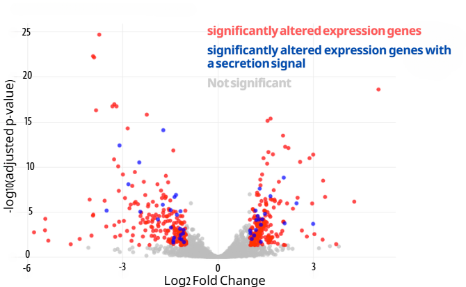
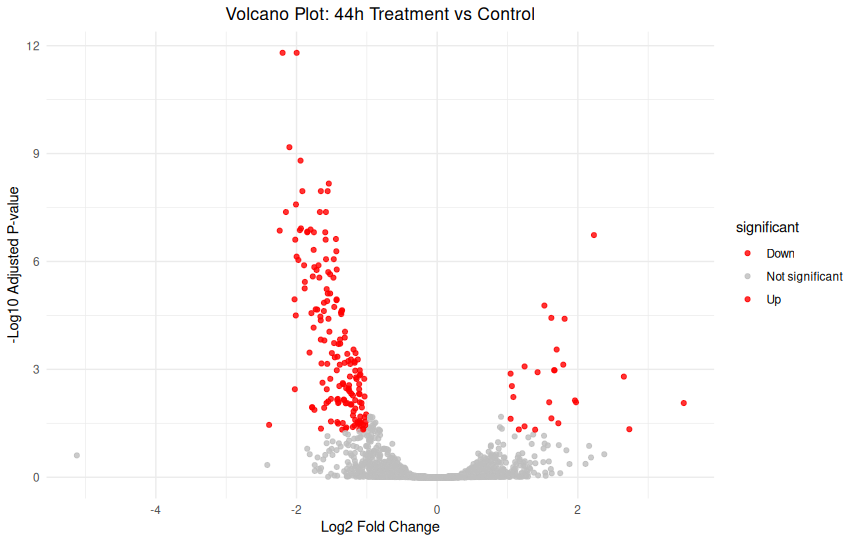
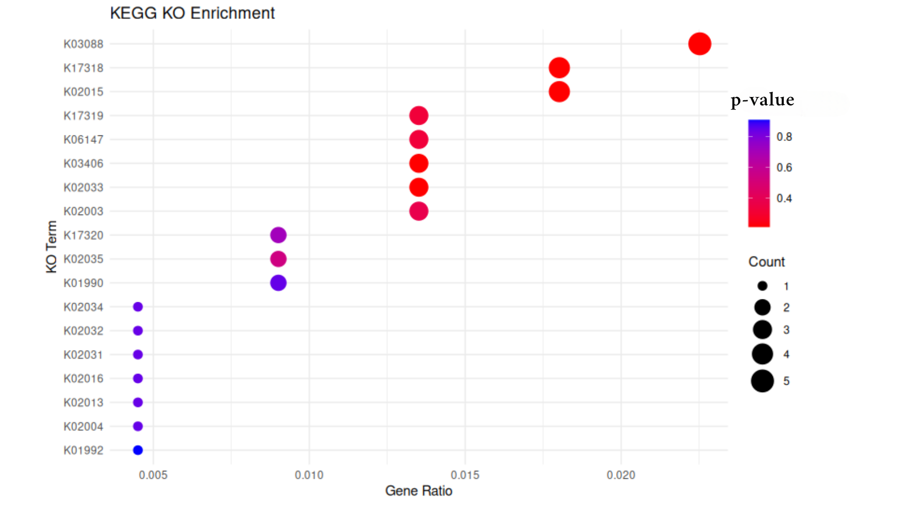

# RNA-Seq Differential Expression Analysis with DESeq2
For this stage i used R studios.
## 1. Set Working Directory and Load Data

First, set the working directory and load the count and metadata files.

```r
# Set working directory
setwd("~/path/to/deseq2/input/directory")

# Load count data (Counts.csv)
f_counts <- "/path/to/deseq2/input/directory/Counts.csv"
counts1 <- read.csv(f_counts, sep = ",", stringsAsFactors = FALSE, header = TRUE, row.names = 1)

# Load metadata (metadata.csv)
f_design <- "/path/to/deseq2/input/directory/metadata.csv"
design1 <- read.csv(f_design, sep = ",", stringsAsFactors = FALSE, header = TRUE, row.names = 1)
```
## 2. Sometimes you need to Remove "GeneID" as a column from Counts
you need to make sure the rows of the factors in the metadata file (TimePint & Treatment) match the columns in the counts file. these will be the names of your samples. additionally, they should appear in the **same order**.

in order for the to match, the GeneID columns must be removed from the counts file (i also think you can not give this column a name from the getgo but i havent checked it)

*not always neccesry
```r
# removefirst column in counts. if your geneID column isnt the first one, adust the code

counts3 = counts3[, -1]
```


## 3. Ensure Columns Match Rows and Convert Strings to Factors
you need to make sure the rows of the factors in the metadata file (TimePint & Treatment) match the columns in the counts file. these will be the names of your samples. additionally, they should appear in the **same order**.

Ensure that the columns in the count data and rows in the metadata match. Convert metadata variables to factors, as DESeq2 requires factors, not strings, for experimental design.

```r
colnames(counts1) #check column names of counts1
rownames(design1) #check row names of design1 (the metadata)
colnames(counts1) <- rownames(design1) # make colnames as rownames
identical(colnames(counts1), rownames(design1)) # check if identical

#should return TRUE if both match and are in the same order
#design1->my metadata, counts1-> my counts
all(rownames(design1) == colnames(counts1)) # check if identical
```
## 4. convert metadata file (design1) from string type to factor
deseq know to work with factors and not string.
```r
#Convert metadata (in my case - design1) to factors
colData <- as.data.frame(apply(design1, c(1, 2), as.factor))
```
## 5. Create Model Matrix (optional)
Sometimes, people create a model matrix to check how their design is structured before running DESeq2, i.e. how we divide the data (in this case by time points and with and without surfactant treatment). In our case, this step is just to make sure that the system knows our factors, and is **not mandatory**.

```r
# Create model matrix for experimental design
modelMatrixTest <- as.data.frame(model.matrix(~ treatment + TimePoint, data = colData))

# View model matrix
View(modelMatrixTest)

```

## 6. Filter Genes with Low Counts
Filter out genes with low counts, retaining only those with a count greater than 5 in at least 3 samples, and that the sum of all counts (across all samples) is over 100. This way we make sure we capture genes wihch are not noise.

```r
# Filter genes with low counts 
keep = rowSums(counts1 > 5) >= 3 & rowSums(counts1) >100
counts3 = counts1[keep, ]
```

## 7. Create DESeqDataSet
Create a DESeqDataSet object that contains the count data, the metadata, and the experimental design. this dataset combines everything deseq2 needs, and we will run deseq2 on this dataset.

```r
# Load DESeq2 (and make sure its installed)
library(DESeq2)

# Create DESeqDataSet
dds = DESeqDataSetFromMatrix(
  countData = counts3,   # Use filtered count data
  colData = colData,     # Metadata
  design = ~ TimePoint*Treatment   # each parameter compered within and interaction
)
```
## 8. Set Reference Level for Treatment
DESeq2 compares gene expression between groups, and it needs to know which group is the "baseline" for comparisons. This is called the reference level.
in my case, the 'control' (no surfactin treatment) will be that baseline.

```r
# Check current levels of 'treatment'. should be the name of the chosen column in the metadata file (colData).
levels(dds$Treatment)

# Set 'control' as the reference level
dds$treatment <- relevel(dds$Treatment, ref = "control")
```
 ## 9. Initial PCA to Check Data
Perform an initial Principal Component Analysis (PCA) to visualize variation in the data and check for batch effects or outliers.

✅ Good sign: Samples cluster by treatment (e.g., "Social" and "Isolated" separate).                                                             
❌ Bad sign: Samples cluster by something unrelated (e.g., sequencing date).

PCA helps us spot issues early before running DESeq2.

```r
# Stats
vcd <- vst(dds, blind = FALSE) # VST normalization
plotPCA(vcd, intgroup = c("TimePoint","Treatment")) # PCA
```


## 10. Run DESeq2
Run DESeq2 to perform differential expression analysis.
```r
# Run DESeq2 analysis
dds <- DESeq(dds)
```
## 11. Viewing comparisons made and setting variables for each comparison
```r
resultsNames(dds) #shows you the comparisons deseq made
compare1 <- resultsNames(dds)[2] # Variable assignment of TimePoint comparison
compare2 <- resultsNames(dds)[3] #Variable assignment of Surfactin treatment comparison
```
## Now we will work on each comparison seperatlly 
even though it the exact same code

## TimePoint (compare1) -------------------------------------
### A. show results
```r
res <- results(dds, name=compare1)
head(res, 2) # just to see how it looks like

# Explanation
mcols(res, use.names = T)
expl <- mcols(res, use.names = T)
```
### B. Save the results
at this point its recommended to save your results:
```r
# Save
summary(res)
write.table(res,
            file = "DE Timepoint.csv",
            sep = ",",
            row.names = T,
            quote = F)
```
### C. AM plot
An MA plot visualizes the differences in gene expression between two conditions.

X-axis (A) = Average expression of a gene across both samples (in log scale).
→ Genes with higher expression overall are farther to the **right**.

Y-axis (M) = Log2 fold change (log₂FC) between the two conditions.
→ Genes above 0 are upregulated, and genes below 0 are downregulated (compared to the reference).

####  What is Log₂ Fold Change?

**Log₂ fold change** is a way to describe how much a gene's expression changes between two conditions, like treatment vs. control.


1. **Fold change** is the ratio of expression between two conditions: 

    Fold change = Expression in Treatment / Expression in Control

2. We then take the **log base 2** of this ratio to get the **log₂ fold change**.
 
 3. example:


    If a gene is expressed **twice as much** in treatment:
    → Fold change = 2
    → log₂(2) = +1

    If a gene is expressed **half as much** in treatment:
    → Fold change = 0.5
    → log₂(0.5) = -1


```r
# Plot
plotMA(res)
```


When measuring gene expression differences between conditions, we often use **log2 fold change (LFC)** to show how much a gene's expression increases or decreases.

However, **genes with low counts** can show **misleadingly high LFC values**. Shrinkage helps make these results more reliable.

---

#### 🧪 Example: Two Genes with the Same Fold Change

| Condition | Gene A (low count) | Gene B (high count) |
|-----------|--------------------|----------------------|
| Control   | 2 counts           | 1,000 counts         |
| Treatment | 4 counts           | 2,000 counts         |

####  Step 1: Fold Change

- **Gene A**: 4 / 2 = 2-fold
- **Gene B**: 2000 / 1000 = 2-fold

####  Step 2: Log2 Fold Change

- **Gene A**: `log2(4/2) = log2(2) = +1`
- **Gene B**: `log2(2000/1000) = log2(2) = +1`

So both seem to have **+1 log2 fold change**.

---

#### ⚠️ What's the Problem?

- **Gene A** has very low counts (2 → 4)
  - This change could be **random noise**.
  - The LFC is **unreliable**.
- **Gene B** has high counts (1000 → 2000)
  - This change is **statistically stable** and trustworthy.

---

#### 🧽 What Shrinkage Does

Shrinkage (like `lfcShrink()` in DESeq2) **pulls unreliable log fold changes closer to 0** when counts are low:

- **Gene A** might shrink from `+1 → +0.2`
- **Gene B** stays around `+1`

This makes the MA plot and downstream analysis more robust.

---
shrink with the following code:

```r
resLFC <- lfcShrink(dds, coef = compare1,
                    type = "apeglm")
plotMA(resLFC, ylim=c(-3,3))
plotMA(resLFC)
```
the reference is according to what you set when you created the dateset or according to the deseq default. To know what the reference is, if you are not sure, you need to run the following code, it will give you a list of the two parameters being compared, with the first being the reference.

```r
# Reference of MA plot
levels(dds$TimePoint)
```
In this case the reference is 20 hourns, and the plot looks like this:


and after shrinking like this:


### Top gene
These lines of code will reveal the gene whose expression level changes most significantly (lowest adj p value) between the two conditions (here between two time points, 20 and 44 hours):

```r
top_gene <- which.min(res$padj)
plotCounts(dds, gene = top_gene, intgroup = "TimePoint")
```


You can also build a plot from the same data that displays it differently (divided by treatments) like this:

```r
#same plot (top gene), more nice

library(ggplot2)
install.packages("ggplot2")

geneCounts = plotCounts(dds, gene = top_gene, intgroup = c("TimePoint", "Treatment"), returnData = TRUE)
ggplot(geneCounts, aes(x=Treatment, y=count, color=TimePoint))+geom_point(size = 6, position=position_jitter(w=0.1,h=0))+ggtitle(paste('Normolize Counts for', rownames(dds[top_gene])))
```


## Treatment (compare2) -------------------------------------
Let's do the same fot treatment (with and without surfactin)
this is the whole code:

```r
# Res for Treatment ----
res <- results(dds, name=compare2)
head(res, 2)

# Explanation
mcols(res, use.names = T)
expl <- mcols(res, use.names = T)

# Save
summary(res)
write.table(res,
            file = "DE Treatment.csv",
            sep = ",",
            row.names = T,
            quote = F)

# Plot
plotMA(res)

resLFC <- lfcShrink(dds, coef = compare2,
                    type = "apeglm")
plotMA(resLFC, ylim=c(-3,3))
plotMA(resLFC)

# Top Genes
top_gene <- which.min(res$padj)
plotCounts(dds, gene = top_gene, intgroup = "Treatment")

#same plot (top gene), more nice

geneCounts = plotCounts(dds, gene = top_gene, intgroup = c("TimePoint", "Treatment"), returnData = TRUE)
ggplot(geneCounts, aes(x=Treatment, y=count, color=Treatment))+geom_point(size = 6, position=position_jitter(w=0.1,h=0))+ggtitle(paste('Normolize Counts for', rownames(dds[top_gene])))
```
and the results are:
AM plot compering treatment to control (reference)

shrinked MAplot


## Interaction (compare2) -------------------------------------
Here we are comparing the effect of the treatment (surfactin) at 20 hours to its effect at 44 hours. the 20 hours will be the baseline. 

the qustion - *“Is the difference between Control and Treated at 44h different from the difference at 20h?”*

#### Concept

1. At each time point, you compute the log2 fold change (log2FC) between treatment and control.

2. Then, you subtract the log2FCs between time points to get the interaction effect.

#### Example


We have two time points: **20 hours** and **44 hours**.  
We want to see **how the effect of treatment changes** between these time points.

#### 🧬 Expression values

| Time Point | Condition | Expression |
|------------|-----------|------------|
| 20h        | Treated   | 120        |
| 20h        | Control   | 100        |
| 44h        | Treated   | 180        |
| 44h        | Control   | 100        |

---

**At 20h:**

- Ratio = 120 / 100 = 1.2  
- `log2(1.2) ≈ 0.263`

**At 44h:**

- Ratio = 180 / 100 = 1.8  
- `log2(1.8) ≈ 0.847`

---

Interaction log2FC = log2FC_44h - log2FC_20h = 0.847 - 0.263 = 0.584

that for the Y axis.

For the x axis - the average is calculated across all four conditions.


```r
# Res for interaction ---------------------------------------------------------
res <- results(dds, name=compare3)
head(res, 2)

# Explanation
mcols(res, use.names = T)
expl <- mcols(res, use.names = T)

# Save
summary(res)
write.table(res,
            file = "DE Timepoint.csv",
            sep = ",",
            row.names = T,
            quote = F)

# Plot
plotMA(res)

resLFC <- lfcShrink(dds, coef = compare3,
                    type = "apeglm")
plotMA(resLFC, ylim=c(-3,3))
```
and the results are:

AM plot compering effect of treatment between two time points


shrinked MAplot


## VST Transformation

Count data tends to have high variability: genes with low counts often have very large variances, while genes with high counts usually have lower variability.

The goal of VST is to make the data more suitable for downstream analyses like PCA or clustering.

VST transforms the count data so that the variance (spread of the data) is no longer dependent on the mean (the average expression level). This means that, after applying VST, genes with both high and low expression will have similar variability, making them easier to compare.

**Note**: we already did this transformation hen we initialy checked the data in a PCA plot (we called it vcd).


### NMDS plot
Non-metric Multidimensional Scaling (NMDS) is a method used to visualize the similarity or dissimilarity between samples. It takes complex, high-dimensional data and reduces it to a 2D or 3D plot where similar samples appear close together and different ones are farther apart.

NMDS is especially useful when your data is not normally distributed (which is often the case with gene expression) and when you want to visualize group patterns or treatment effects without making strong assumptions about the data.

- k: The number of dimensions the data is reduced to (usually 2 for a flat plot). A higher k may give a better fit but is harder to visualize.

- Stress: A number that tells us how well the NMDS plot represents the true distances between samples. Lower stress means better representation.

    - Stress < 0.2 = good

    - Stress > 0.3 = poor fit

```r
###### NMDS PLOT ######

#install package
install.packages("vegan")
library(vegan)

#install ggplot
install.packages("ggplot2", dependencies = TRUE)
library(ggplot2)

#prepare the transfotmed (vst) data into assay 
vst_counts <- assay (vcd)

#Use bray curtis distances
dist1 = "bray"

#run NMDS
nmds1 = metaMDS(t(vst_counts),k=2,dist=dist1, try=1000)

#create distance matrix for PERMANOVA
bray_dist <- vegdist(t(vst_counts), method=dist1)

#preform PERMANOVA with adonis2 
adonis_res <- adonis2(bray_dist ~ TimePoint * Treatment, data = as.data.frame(colData))
r2 <- round(adonis_res$R2[1], 3)
pval <- adonis_res$`Pr(>F)`[1]

# Data for NMDS plot
df_nmds1 <- as.data.frame(nmds1$points)
df_nmds1$names <- rownames(nmds1$points)
df_nmds1$TimePoint <- colData$TimePoint
df_nmds1$Treatment <- colData$Treatment

# Plot NMDS with stress and PERMANOVA result
ggplot(df_nmds1, aes(x = MDS1, y = MDS2, color = Treatment, shape = TimePoint)) +
  geom_point(size = 6) +
  ggtitle(paste0("VST NMDS; distance = ", dist1,
                 ", stress = ", round(nmds1$stress, 2),
                 "\nPERMANOVA R² = ", r2, ", p = ", pval))


```


**Note** - one conclusion to draw from the NMDS plot is that we need more repeats. there is no way to tell whether there is a difference in the 44hr between treatment and control. 

* its also woth checking whether there is surfactin left after 44 hours (lc-ms or maldi)

## Volcano Plot


### Axes of a Volcano Plot

- **X-axis**: Represents the **log2 fold change (LFC)** between two conditions. It measures the magnitude of gene expression change:
  - Positive values: Upregulated genes in the experimental group (e.g., treatment vs. control).
  - Negative values: Downregulated genes in the experimental group.

- **Y-axis**: Represents the **-log10(p-value)**, which indicates the statistical significance of the gene expression change. Higher values represent more significant changes:
  - High values on the y-axis: Genes that are statistically significant.
  - Low values on the y-axis: Genes with no significant change (p-value is large).

### How is the Volcano Plot Calculated?

1. **Log2 fold change**: This is the difference in gene expression between two conditions, typically calculated as:
   - `log2(fold change)` = log2(Condition A / Condition B)
     - If the gene is upregulated in Condition A compared to Condition B, the fold change is positive.
     - If downregulated, the fold change is negative.

2. **p-value**: This represents the statistical significance of the observed change. Typically, a t-test or a similar statistical test is used to compute the p-value.

3. **-log10(p-value)**: The p-value is transformed to make the plot easier to read and highlight significant changes. Larger p-values (less significant) are represented by smaller values on the y-axis, and smaller p-values (more significant) are represented by larger values.

### Example of a Volcano Plot Calculation

Let's say we have the following data for a gene:

| Gene     | Treatment | Control | p-value   |
|----------|------------------------|------------------------|-----------|
| Gene 1   | 200                    | 50                     | 0.001     |
| Gene 2   | 100                    | 100                    | 0.2       |
| Gene 3   | 150                    | 75                     | 0.05      |

1. **Gene 1**:
   - Fold change: `200 / 50 = 4` → log2(4) = 2 (upregulated)
   - p-value = 0.001 → -log10(0.001) = 3 (highly significant)

2. **Gene 2**:
   - Fold change: `100 / 100 = 1` → log2(1) = 0 (no change)
   - p-value = 0.2 → -log10(0.2) = 0.7 (not significant)

3. **Gene 3**:
   - Fold change: `150 / 75 = 2` → log2(2) = 1 (upregulated)
   - p-value = 0.05 → -log10(0.05) = 1.3 (significant)

### How to Read the Plot

1. **Genes on the left** (negative log2 fold change): These genes are downregulated in the experimental group (e.g., treatment vs. control).
2. **Genes on the right** (positive log2 fold change): These genes are upregulated in the experimental group.
3. **High y-values** (top of the plot): Genes that are statistically significant (low p-values).
4. **Genes far from the origin (either left or right)** are the ones with the largest changes in expression, and the more statistically significant they are, the higher they will be on the y-axis.

### Code
```r
#___________________volcano plot treatment___________________________#

# Load necessary libraries
library(ggplot2)
library(DESeq2)

res = results(dds, contrast = c("Treatment", "treatment1", "control"))

# Create a volcano plot
ggplot(res, aes(x = log2FoldChange, y = -log10(padj))) +
  geom_point(aes(color = padj < 0.05 & abs(log2FoldChange) > 1), alpha = 0.7) +
  scale_color_manual(values = c("gray", "red")) +
  labs(title = "Volcano Plot", x = "Log2 Fold Change", y = "-Log10 Adjusted P-value") +
  theme_minimal() +
  theme(legend.position = "none")

#___________________volcano plot timepoint___________________________#

# Load necessary libraries
library(ggplot2)
library(DESeq2)

# Run DESeq2 (already done) and extract results
# Assuming 'dds' is your DESeqDataSet
res = results(dds, contrast = c("TimePoint", "20", "44"))

# Create a volcano plot
ggplot(res, aes(x = log2FoldChange, y = -log10(padj))) +
  geom_point(aes(color = padj < 0.05 & abs(log2FoldChange) > 1), alpha = 0.7) +
  scale_color_manual(values = c("gray", "gold")) +
  labs(title = "Volcano Plot", x = "Log2 Fold Change", y = "-Log10 Adjusted P-value") +
  theme_minimal() +
  theme(legend.position = "none")

#_______________ volcano plot interaction ___________________________#

res_interaction <- results(dds, name = resultsNames(dds)[4])

# Load necessary libraries
library(ggplot2)
library(DESeq2)

# Add a column to indicate significance
res_interaction$threshold <- as.factor(
  ifelse(res_interaction$padj < 0.05 & abs(res_interaction$log2FoldChange) > 1, "Significant", "Not Significant")
)

# Convert to data frame for ggplot
res_df <- as.data.frame(res_interaction)

# Volcano plot
ggplot(res_df, aes(x = log2FoldChange, y = -log10(padj), color = threshold)) +
  geom_point(alpha = 0.6, size = 1.5) +
  scale_color_manual(values = c("grey", "purple")) +
  theme_minimal() +
  labs(title = "Volcano Plot: TimePoint × Treatment Interaction",
       x = "Log2 Fold Change",
       y = "-Log10 Adjusted p-value")
```


### Results
Time point (20hr reference):


Treatment (control reference):


Interaction:


## 🔍 Differential Gene Expression Analysis Summary

At this stage, I aimed to extract lists of genes that show **significant differential expression** (adjusted *p*-value < 0.05) between treatment conditions. Specifically, I generated four separate gene lists based on timepoint and direction of regulation:

### ✅ Gene Lists Extracted:

1. **Upregulated genes at 20 hours**  
   Genes showing significantly higher expression in the treatment samples (+surfactin) compared to the untreated control at **20 hours**.

2. **Downregulated genes at 20 hours**  
   Genes showing significantly lower expression in the treatment samples (+surfactin) compared to the untreated control at **20 hours**.

3. **Upregulated genes at 44 hours (treatment effect change over time)**  
   Genes that became **more upregulated** at 44 hours compared to both untreated samples and the treatment effect observed at 20 hours. This list captures how the **effect of surfactin changes over time**.

4. **Downregulated genes at 44 hours (treatment effect change over time)**  
   Genes that became **more downregulated** at 44 hours compared to both untreated samples and the treatment effect observed at 20 hours. Again, this reflects a **time-dependent modification** of the surfactin effect.

---

#### ⚠️ Important Interpretation Note

The 20-hour lists directly reflect the **effect of surfactin treatment** at that timepoint. In contrast, the 44-hour lists do **not** show the overall effect of treatment alone at 44 hours — they represent the **difference in treatment effect between 44 hours and 20 hours**.

This means that:

> If a gene is affected by surfactin at 20 hours and maintains that altered expression level at 44 hours (without further change), it will **not** appear as significant in the 44-hour lists.

Therefore, the 44-hour comparison highlights genes whose **expression response to surfactin has changed over time** — either intensifying or reversing between the two timepoints.

#### code in R
```r
# SETUP #

# Set output directory
setwd("/home/oreinish/Desktop/imag_for_github")

# Treatment effect at 20h (baseline)
res_20h <- results(dds, name = "Treatment_treatment1_vs_control")

# Treatment effect at 44h (from interaction term)
res_44h <- results(dds, name = "TimePoint44.Treatmenttreatment1")

# FILTER SIGNIFICANT GENES #

# 20h significant genes
res_20h_filtered <- res_20h[!is.na(res_20h$padj), ]
sig_20h <- res_20h_filtered[res_20h_filtered$padj < 0.05 & abs(res_20h_filtered$log2FoldChange) > 1, ]
up_20h <- sig_20h[sig_20h$log2FoldChange > 1, ]
down_20h <- sig_20h[sig_20h$log2FoldChange < -1, ]

# 44h significant genes
res_44h_filtered <- res_44h[!is.na(res_44h$padj), ]
sig_44h <- res_44h_filtered[res_44h_filtered$padj < 0.05 & abs(res_44h_filtered$log2FoldChange) > 1, ]
up_44h <- sig_44h[sig_44h$log2FoldChange > 1, ]
down_44h <- sig_44h[sig_44h$log2FoldChange < -1, ]


# EXPORT TO CSV #

# Convert to data.frame
up_df_20h <- as.data.frame(up_20h)
down_df_20h <- as.data.frame(down_20h)
up_df_44h <- as.data.frame(up_44h)
down_df_44h <- as.data.frame(down_44h)

# Save
write.csv(up_df_20h, "upregulated_20h.csv")
write.csv(down_df_20h, "downregulated_20h.csv")
write.csv(up_df_44h, "upregulated_44h.csv")
write.csv(down_df_44h, "downregulated_44h.csv")


# OPTIONAL: Preview
cat("Number of significant upregulated genes (20h):", nrow(up_df_20h), "\n")
cat("Number of significant downregulated genes (20h):", nrow(down_df_20h), "\n")
cat("Number of significant upregulated genes (44h):", nrow(up_df_44h), "\n")
cat("Number of significant downregulated genes (44h):", nrow(down_df_44h), "\n")
```
I than combined them all in one csv file:
📎[Link to data](../exel%20files/deseq2/combined.csv) 

--- 

### Gene ID clean-up


The gene id in the output lists are long and i decided to do an extra step just to make it more clean and workable. i wanted to add an another column in the table, to move from this:
| GeneID                                                                                                             | baseMean     | log2FoldChange | lfcSE        | stat        | pvalue       | padj        | list  |
|--------------------------------------------------------------------------------------------------------------------|--------------|----------------|--------------|-------------|--------------|-------------|--------|
| gene_id "PDENDC454_28240"; transcript_id ""; gbkey "Gene"; gene_biotype "protein_coding"; locus_tag "PDENDC454_28240"; | 594.5642603  | 1.456539923    | 0.276518047  | 5.267431681 | 0.000000138  | 0.00000723  | 20up   |


to this:
| GeneID                                                                                                             | baseMean     | log2FoldChange | lfcSE        | stat        | pvalue       | padj        | list  | GeneID_clean     |
|--------------------------------------------------------------------------------------------------------------------|--------------|----------------|--------------|-------------|--------------|-------------|--------|------------------|
| gene_id "PDENDC454_28240"; transcript_id ""; gbkey "Gene"; gene_biotype "protein_coding"; locus_tag "PDENDC454_28240"; | 594.5642603  | 1.456539923    | 0.276518047  | 5.267431681 | 0.000000138  | 0.00000723  | 20up   | PDENDC454_28240  |


in order to do that i ran it throuh a **python** code (also esier in xl format not csv):

```python
import pandas as pd
import re

# Load the Excel file
input_file = 'pathway/to/excel/file.xlsx'  # Replace with your actual file path
output_file = 'pathwat/to/output/file.xlsx'  # Replace with your desired output file path

# Read the Excel file into a DataFrame
df = pd.read_excel(input_file)

# Function to extract Gene ID from the "GeneID" column
def extract_gene_id(gene_id_str):
    # Use regular expression to extract the gene ID
    match = re.search(r'gene_id\s+"([^"]+)"', gene_id_str)
    if match:
        return match.group(1)
    else:
        return gene_id_str  # If no match, return the original string

# Apply the function to the 'GeneID' column and create a new column with cleaned Gene IDs
df['GeneID_clean'] = df['GeneID'].apply(extract_gene_id)

# Optional: Drop the original 'GeneID' column if you no longer need it
# df = df.drop(columns=['GeneID'])

# Save the updated DataFrame to a new Excel file
df.to_excel(output_file, index=False)

print(f"Updated Excel file saved as {output_file}")

```
[link to data](../exel%20files/deseq2/combined_xl_fixed.xlsx)

---
###  Add proper annotations
the GTF annotations in the xl table dont give us much information. we need to search the gene ID in a database like NCBI in order have an idia on what the gene does. the problem is that the GTF file has several lines for each gene id but with different classifications (gene/stop codon/CDS) like this:
| SeqID          | Source   | Feature     | Start | End  | Score | Strand | Frame | Attributes                                                                                                                                                                                                 |
|----------------|----------|-------------|-------|------|--------|--------|--------|------------------------------------------------------------------------------------------------------------------------------------------------------------------------------------------------------------|
| AHKH01000198.1 | Genbank  | gene        | 8782  | 9798 | .      | +      | .      | gene_id "PDENDC454_28575"; transcript_id ""; gbkey "Gene"; gene_biotype "protein_coding"; locus_tag "PDENDC454_28575";                                                                                      |
| AHKH01000198.1 | Genbank  | CDS         | 8782  | 9795 | .      | +      | 0      | gene_id "PDENDC454_28575"; transcript_id "unassigned_transcript_8"; db_xref "NCBI_GP:EHQ58774.1"; gbkey "CDS"; locus_tag "PDENDC454_28575"; note "COG3173 Predicted aminoglycoside phosphotransferase"; product "hypothetical protein"; protein_id "EHQ58774.1"; transl_table "11"; exon_number "1"; |
| AHKH01000198.1 | Genbank  | start_codon | 8782  | 8784 | .      | +      | 0      | gene_id "PDENDC454_28575"; transcript_id "unassigned_transcript_8"; db_xref "NCBI_GP:EHQ58774.1"; gbkey "CDS"; locus_tag "PDENDC454_28575"; note "COG3173 Predicted aminoglycoside phosphotransferase"; product "hypothetical protein"; protein_id "EHQ58774.1"; transl_table "11"; exon_number "1"; |
| AHKH01000198.1 | Genbank  | stop_codon  | 9796  | 9798 | .      | +      | 0      | gene_id "PDENDC454_28575"; transcript_id "unassigned_transcript_8"; db_xref "NCBI_GP:EHQ58774.1"; gbkey "CDS"; locus_tag "PDENDC454_28575"; note "COG3173 Predicted aminoglycoside phosphotransferase"; product "hypothetical protein"; protein_id "EHQ58774.1"; transl_table "11"; exon_number "1"; |

---
as you can see the attributes are the same, in this case : "hypothetical protein", and its what you find when you search for the gene id in NCBI.

i wanted to add another column to the table with those annotations.
in order to do this, i ran this **python** code:

```python
import pandas as pd
import re

# File paths
excel_file = 'pathwat/to/excel/file(with a column called 'GeneID_clean').xlsx'  # Replace with your actual Excel file path

gtf_file = 'pathway/to/relevant/gtf/file.gtf'  # Replace with the path to your GFF file
output_file = 'pathwat/to/output/file.xlsx'  # Output Excel file

# Step 1: Read Excel with gene IDs
df = pd.read_excel(excel_file)

# Step 2: Parse GTF and collect gene_id -> product mapping (only once per gene_id)
gene_product_map = {}

with open(gtf_file, 'r') as gtf:
    for line in gtf:
        if line.startswith('#'):
            continue

        columns = line.strip().split('\t')
        if len(columns) < 9:
            continue

        attributes = columns[8]
        
        # Extract gene_id
        gene_match = re.search(r'gene_id "([^"]+)"', attributes)
        product_match = re.search(r'product "([^"]+)"', attributes)

        if gene_match:
            gene_id = gene_match.group(1)
            if gene_id not in gene_product_map and product_match:
                gene_product_map[gene_id] = product_match.group(1)

# Step 3: Map each GeneID_clean to the annotation
def get_annotation(gene_id):
    return gene_product_map.get(gene_id, "Annotation not found")

df['Annotation'] = df['GeneID_clean'].apply(get_annotation)

# Step 4: Save to new Excel file
df.to_excel(output_file, index=False)

print(f"Annotated file saved to: {output_file}")
```
[link to data](../exel%20files/deseq2/combined_xl_fixed_annotated.xlsx)

---
### Adding amino acid sequences

part of what im trying to find is the peptithse who cuts the surfactin. so i am intrested in genes who have a secrition signal to leave the cell. i therefor wanted to add the amino acid sequence to the table. later on i can use it to ran a tool called *signalIP* to locate secrition signales.

To add the amino acid sequences i used linux command line.
you will need a database where the gene id appears as in your table and the relevant aa sequence - in this case, ifound it a gbff file i downloaded from NCBI.

1. in the command line install biopython & needen tools:
```
pip install biopython
conda install pandas
conda install openpyxl
```
2. in your code directory, open a new python code file:
```
nano AddAAseqFromGBFF.py
```
3. write the code in the nano file:
```py
#!/usr/bin/env python3

from Bio import SeqIO
import pandas as pd

# === USER INPUT ===
gbff_file = "/home/oreinish/RNA_seq/raw_data/pdc454FASTA/genomic.gbff"
excel_file = "/home/oreinish/RNA_seq/deseq2/dseq2_output/combined_xl_fixed_annotated.xlsx"
output_file = "/home/oreinish/RNA_seq/deseq2/dseq2_output/with_aa_seq.xlsx"
# ===================

# Step 1: Parse GenBank and extract {locus_tag: aa_sequence}
locus_to_seq = {}
for record in SeqIO.parse(gbff_file, "genbank"):
    for feature in record.features:
        if feature.type == "CDS":
            locus_tag = feature.qualifiers.get("locus_tag", [None])[0]
            aa_seq = feature.qualifiers.get("translation", [None])[0]
            if locus_tag and aa_seq:
                locus_to_seq[locus_tag] = aa_seq

# Step 2: Load Excel file
df = pd.read_excel(excel_file)

# Step 3: Add aa_seq column using GeneID_clean
df["aa seq"] = df["GeneID_clean"].map(locus_to_seq).fillna("Not found")

# Step 4: Save to new Excel file
df.to_excel(output_file, index=False)
print(f"Saved with amino acid sequences: {output_file}")

```

4. make the code executable (in the command line):

```
chmod +x AddAAseqFromGBFF.py
```
5. run the script (command line)
```
./AddAAseqFromGBFF.py
```
The result in a excel table with an added column called "aa seq" which contains the amino acid sequences.

[link to data](../exel%20files/deseq2/with_aa_seq_and%20annotation.xlsx)

---
### Find secretion signals

1. create a csv file with two columns: "GeneID_clean" and "aa seq".
2. use **python** to convert into a FASTA file:
```py
import pandas as pd

# Load your CSV
df = pd.read_csv("pathway/to/csv/file.csv")  # <-- Replace with your actual filename

# Open a FASTA file to write to
with open("output_sequences.fasta", "w") as fasta_out:
    for index, row in df.iterrows():
        header = f">{row['GeneID_clean']}"
        sequence = row['aa seq'].replace(" ", "").replace("\n", "")  # Just in case
        fasta_out.write(f"{header}\n{sequence}\n")

```

3. copy the output, shuld look like this:
```
>PDENDC454_28240
MEGAIRKPVINPMHGGRCGTRKEQTTMTQRRKVTIWNEYRHEQNNPKVAEVYPKGIHQAIGEGLGSGCDIRYATLDMPEHGLTEEVLNDTDVLIWWGHMAHHEVDDAIVERVHQRVLHGMGLIVLHSGHFSKIFKKLMGTGCDLKWREANDKERLWVVAPNHPIAEGIGEYFELEREEMYGEHFDIPQPDELVFVSWFTGGEVFRSGCCYHRGMGKVFYFRPGHETYPTYYNENVKRVIANAVEWAAPTKRAYPVYGNAKPLEPMNE
>PDENDC454_28245
MKLGVFLVLYGQLSLEEALDTVAAKGVEAVEIGTGGYPGNKHCNPHELLADEAKQRAFKEAVESRGLIISALSCHGNPLHPQKDIAKAYHDDFMATIDLAAKLGVPVVNGFSGCPGDHEGAKYPNWPVAPWPNDYQEILDWQWNEKIIPYWKEVGKYAQDRGIKIGLELHGGFSVHSPGTMLRLREATCDAIGANLDPSHMWWQGIDPVQAVRILGKENAIHHFHAKDTTIDPINVNKHGVTDMQSYTMMLDRAWQFRTVGYGHDVKTWADIVSALRLVGYDYVVSIEHEDGLMSIDEGFTKAVQNLQPLLMKEPLGEMWWV
>PDENDC454_28250
MSNIYKIAIIGCGGIANGKHMPSLKKLDNVQMVAFCDIIPERAEEAKAKYGTEDAKVYSDYKELLKDGSIDIVHVCTPNDSHAEITIAALESGKHVMSEKPMAKTAVDARRMVEAAKRTGKKLTVGYNNRFRSDSQYLKQLCEDGTLGDIYYAKAHAIRRRAVPTWGVFLDEEKQGGGPLIDIGTHALDLTLWMMNNYEPKIVLGSSFHKLGSRPNAANAWGSWDPEKFKVEDSAFGMIVMKNGATIVLESSWALNVAQSGEAKCTLCGTEAGADMWNGLNINGEKYGRLYDQKIELTAGGVDFYDGEAENAPDLEMRLWIDAIEQDKEPVVTPEQACVVSEILEAIYESSRTGKAIYFD
>PDENDC454_28255
MKIGVQLYTVRDETAKNFIGTLEKIAEMGYEGVEFAGYGGLKAQELADALKRLNLAAAGSHVSIEQLVDHLDEQIEMNTAIGNRYIACPGIQESRYNSLEALLHTAEQLANASDRLAEHGIKLGYHNHDFEFTRKLGDDTVFDTLFRLVPAEKLFTELDVCWVQYAGYDPLSVIASYKGRIPLVHYKDLRRDEQGRPLTVELGEGELDLVSIARASKEAGAEWLIVEQDECQRPSLESIRNSRQWIKNNLGQ
>PDENDC454_28190 

and so on....
```
4. paste in to the box in [SignalP - 6.0](https://services.healthtech.dtu.dk/services/SignalP-6.0/) (up to 1000 sequences) and submmit.


   * [output from SignalP - 6.0](../exel%20files/deseq2/secrition_prediction_results.xlsx)

    * [full updated table](../exel%20files/deseq2/full_table_with_secretion_predictions.xlsx)

5. another gene,PDENDC454_15002, was identifyed as a potential secreted protein by crossing my [list](../exel%20files/deseq2/full_table_with_secretion_predictions.xlsx) with a list of proteins in the paper [Secretome of Paenibacillus sp. S‑12 provides an insight about its survival and possible pathogenicity](../pdf%20protocols%20and%20papers/secretome%20paper.pdf). there was 0.946808510638298% similarity. comparison was don in pytonn. input was a excel file with two columns containing amino acid sequences; one is my list (column name 'dataset'), the other the one from the paper (column name 'prob'). the python code is as following:

```py
import pandas as pd
from difflib import SequenceMatcher

# Load the Excel file
file_path = 'pathway/to/two-column/excel/file.xlsx'  # or your local path if running on your computer
df = pd.read_excel(file_path)

# Extract the two columns
dataset_seqs = df['dataset'].dropna().tolist()
prob_seqs = df['prob'].dropna().tolist()

# Function to calculate similarity
def sequence_similarity(seq1, seq2):
    return SequenceMatcher(None, seq1, seq2).ratio()

# Find matches
matches = []

for seq1 in dataset_seqs:
    for seq2 in prob_seqs:
        similarity = sequence_similarity(seq1, seq2)
        if similarity >= 0.90:
            matches.append((seq1, seq2, similarity))

# Output results
matches_df = pd.DataFrame(matches, columns=['dataset_seq', 'prob_seq', 'similarity'])
matches_df.to_excel('matching_sequences_95percent.xlsx', index=False)

print(f"Found {len(matches)} matching pairs with ≥90% similarity.")
print("Saved results to 'matching_sequences_95percent.xlsx'.")
```
I colored the proteins with a secretion signal in blue (sane 20hr volcano plot as before but with marked proteins)

I also ran the DEGs (20hr and 44interaction) through *PSORTb* which predicts proteine location according to amino acid sequences. didnt find any proteins who are predicted to be 'extracellular' & up regulated at 20hr. 



important - there are other ways for a proteine to leave the cell that dont include a secrition signal. in the future i plan to use tools like SecretomeP and BacSec.

### looking for proteases amongs the secreted DEGs (with secretion signal)

we suspect that the surfactin is breaked down outside the cell. so i wantes to check those blue proteines (DEGs with secretion signal). i ran their AA sequences thorough a tool called [*InterPro*](https://www.ebi.ac.uk/interpro/) which gives the protein family prediction.

i took the [output (tsv)](../exel%20files/deseq2/iprscan5-R20250618-151146-0939-12498014-p1m.tsv), inputed it in python script in order to find proteines which have an ability to break down molecules:

```py
import pandas as pd

# Define input file path
input_file = "C:/Users/USER/OneDrive - University of Haifa/Documents/HAIFA/research/data analyzing/MEROPS/iprscan5-R20250618-151146-0939-12498014-p1m.tsv"

# Load the TSV file (tab-separated values)
df = pd.read_csv(input_file, sep='\t', header=None, comment='#')

# InterPro format: assume the annotation is in column 11 or 12
# Check column headers manually if different
annotation_columns = [11, 12]  # may contain descriptions

# Define keywords to search for
keywords = ['protease', 'hydrolase', 'peptidase', 'proteinase', 'lipase', 'amidase']

# Convert annotations to lowercase for easier matching
matches = df[df[annotation_columns].apply(
    lambda row: any(any(k in str(cell).lower() for k in keywords) for cell in row), axis=1)]

# Extract unique gene IDs (column 0 is usually the ID)
gene_ids = sorted(matches[0].unique())

# Save to a file (optional)
with open("cutting_genes.txt", "w") as f:
    for gene in gene_ids:
        f.write(gene + "\n")

# Print to screen
print("Genes with cutting activity:")
for gene in gene_ids:
    print(gene)

```
the output was a list of 10 proteins :
* PDENDC454_03969 -> down regulated in 20hr
* PDENDC454_08250 -> up regulated in 20hr
* PDENDC454_11515 -> down regulated in 20hr
* PDENDC454_11605 -> down regulated in 20hr
* PDENDC454_12640 -> up regulated in 20hr
* PDENDC454_15202 -> down regulated in 20hr
* PDENDC454_16983 -> down regulated in 20hr
* PDENDC454_19433 -> up regulated in 20hr
* PDENDC454_22744 -> down regulated in 20hr
* PDENDC454_23676 -> down regulated in 20hr

so these are proteines who are DE, secreted and are able to cut molecules. of these 3 are up regulated after 20 hr of surfactin exposure. 

----
### GOseq enrichment plot
in order to even start you need a table that has the 4 componenets:
* gene ID (for example PDENDC454_28720)
* is it significant or not (0/1) in my deseq table the colunm is called "significant".
* Length of the gene. (goseq does addinionaly normalization for length)
* the matching GO term of the gene (looks like this: "GO:0000049").

the gene id and the significance i already got from the deseq table.

#### length
the length you can get from the GTF file. since you used it to create the deseqtable (back when you did quantification), the gene names of the gtf table and the deseq output match. the gtf has information about the start and end nucleotide, and from this you can calculate the length. **here i used the deseq results which compared treatment vs control at 20 hr.**

**step one**: merge the tables using this python script:

```py
import pandas as pd
import re

# ======== 🔧 File Paths ========
deseq_path = "C:/Users/USER/OneDrive - University of Haifa/Documents/HAIFA/research/data analyzing/deseq_results_20hr.xlsx"
gtf_path = "C:/Users/USER/OneDrive - University of Haifa/Documents/HAIFA/research/data analyzing/genomic.gtf"
output_path = "C:/Users/USER/OneDrive - University of Haifa/Documents/HAIFA/research/data analyzing/mapping/combined_deseq2_gtf.xlsx"

# ======== 🔍 Functions ========
def extract_gene_id(attr):
    match = re.search(r'gene_id\s+"([^"]+)"', attr)
    return match.group(1) if match else None

# ======== 📥 Load Data ========
# Load DESeq2 results
deseq_df = pd.read_excel(deseq_path)

# Extract clean gene_id if necessary
if "gene_id" not in deseq_df.columns or deseq_df["gene_id"].astype(str).str.contains("gene_id").any():
    deseq_df["gene_id"] = deseq_df["gene_id"].apply(lambda x: extract_gene_id(str(x)))

# Load GTF file
gtf_df = pd.read_csv(
    gtf_path,
    sep='\t',
    comment='#',
    header=None,
    names=['seqname', 'source', 'feature', 'start', 'end', 'score', 'strand', 'frame', 'attribute']
)

# Filter only `gene` entries
gtf_genes = gtf_df[gtf_df['feature'] == 'gene'].copy()

# Extract gene_id from the attribute column
gtf_genes['gene_id'] = gtf_genes['attribute'].apply(extract_gene_id)

# Keep relevant columns and remove duplicates
gtf_genes = gtf_genes[['gene_id', 'seqname', 'start', 'end', 'strand']].drop_duplicates()

# ======== 🔗 Merge and Save ========
combined_df = pd.merge(deseq_df, gtf_genes, on='gene_id', how='left')
combined_df.to_excel(output_path, index=False)

print("✅ Combined file saved with only gene features and positions:")
print(output_path)
```
**step 2**: use excel to calcolate the length (end nucleotide - start nucleotide)

[merged table deseq+gtf](../exel%20files/deseq2/combined_deseq2_gtf_with_length.xlsx)

### GO terms
1. Get a tsv file from [Unprot](https://www.uniprot.org/uniprotkb?query=Paenibacillus+dendritiformis+c454):
    * search peanibacillus dentritiformis c454 & download.
    * make sure you you mark "Gene ontology IDs" under "Gene Ontology"
2. upload the tsv unprot file to [Galaxy](https://usegalaxy.org/datasets/f9cad7b01a472135871d74b658a6767e/preview)
3. use the tool "cut columns from table" so you are left with two columns only - "Gene Name" & "Gene ontology IDs" (typically c5,c8)
4. use the tool "convert deliminaters to TAB" and choose "semicolons".

 Now you have a table where the first column is called "Gene Names" ans several columns which are GO terms (Gene ontology IDs), each gene can have several, and the next thing we want to do is to create a table with 2 columns only. if a gene has more than one go-term, it will appear more than one time in the first column.

5. Export from galaxy and save as an excel file.
6. Run this python on this table. it is ment to "clean" the gene names so that only this form will stay :**PDENDC454_#####**.
```py
import pandas as pd
import re

# === File paths ===
input_excel = "pathway/to/galaxy/output/in/excel/file.xlsx"  # 🔁 Replace with your file name
output_excel = "pathway/output/in/excel/file.xlsx/cleaned_gene_names.xlsx"

# === Load the Excel file ===
df = pd.read_excel(input_excel)

# === Clean Gene Names column ===
def extract_gene_id(name):
    match = re.search(r"PDENDC454_\d+", str(name))
    return match.group(0) if match else None

df["Gene Names"] = df["Gene Names"].apply(extract_gene_id)

# === Save to new Excel file ===
df.to_excel(output_excel, index=False)

print(f"✅ Cleaned Excel file saved as: {output_excel}")
```

7. Then run the cleaned table throuh this python code. its ment to break down each gene-name to several rows. each gene-name/GO-term will get its own raw.

```py
import pandas as pd
import re

# === File paths ===
input_excel = "pathway/to/cleaned/named/table/file.xlsx"  # <- replace with your actual file path
output_excel = "pathway/output/in/excel/file.xlsx"

# === Load Excel file ===
df = pd.read_excel(input_excel)

# === Identify GO term columns ===
go_columns = [col for col in df.columns if col.startswith("Gene Ontology")]

# === Build output table ===
output_rows = []

for _, row in df.iterrows():
    gene_id = row["Gene Names"]
    for go_col in go_columns:
        go_term = str(row[go_col]).strip()
        if re.match(r"GO:\d{7}", go_term):  # Keep only valid GO terms
            output_rows.append({
                "Gene ID": gene_id,
                "GO Term": go_term
            })

# === Save to Excel ===
output_df = pd.DataFrame(output_rows)
output_df.to_excel(output_excel, index=False)

print(f"✅ Done! Output saved to: {output_excel}")
```
 Now you have a proper table of all [GO terms](../exel%20files/deseq2/goTerms.xlsx).


 once you got the two files - the deseq results with gene length AND the go-term file you can finally run a goseq enrichmeny analysis, usin this code in R:
```r
#______GOseq Enrichment Analysis: Full Pipeline (20hr treatment vs control)__________#

# Step 1: Load required packages
# Only install if not already installed
install.packages("readxl")        # For reading Excel files
install.packages("BiocManager")   # For installing Bioconductor packages

# Load libraries
library(readxl)
library(BiocManager)

# Install and load goseq from Bioconductor
BiocManager::install("goseq")
library(goseq)

# Additional packages for data manipulation
install.packages("dplyr")
install.packages("tibble")
library(dplyr)
library(tibble)

install.packages("readxl")
library(readxl)

install.packages("dplyr")
library(dplyr)


# Step 2: Read your DESeq2 + GTF data from Excel
df_goseq <- read_excel("combined_deseq2_gtf.xlsx")  # this file is for dds(treatment vs control 20hr+length of genes)

# Step 3: Check column names to verify structure
colnames(df_goseq)

# Step 4: Ensure required columns exist and are named correctly
# Required columns: gene_id (ID), significant (1 = DE, 0 = not), and length (gene length for bias correction)
# Rename if needed
names(df_goseq)[names(df_goseq) == "GeneID"] <- "gene_id"  # Adjust if different

# Step 5: Create the named significance vector
# This is a binary vector indicating whether each gene is differentially expressed
gene_vector <- df_goseq$significant
names(gene_vector) <- df_goseq$gene_id

# Step 6: Create the named gene length vector
# Used to correct for length bias in GOseq
gene_lengths <- df_goseq$length
names(gene_lengths) <- df_goseq$gene_id

# Step 7: Preview your data (sanity check)
head(gene_vector)
head(gene_lengths)

# Step 8: Create the Probability Weighting Function (PWF)
# This models selection bias, especially length bias, using the binary DE vector
pwf <- nullp(gene_vector, bias.data = gene_lengths, plot.fit = TRUE)

# Step 9: Load your gene-to-GO mapping file
# This reads an Excel (.xlsx) file with at least two columns: gene_id and go_term
go_data <- read_excel("/home/oreinish/Desktop/imag_for_github/goseq/goTerms.xlsx")  # Replace with correct sheet name if needed

# Step 10: Clean and format GO data
# Rename columns for consistency
colnames(go_data) <- c("gene_id", "go_term")  # Adjust if needed

# Step 11: Convert GO data to format expected by goseq
# This creates a named list where each GO term maps to a vector of genes
go_list <- go_data %>%
  group_by(go_term) %>%
  summarise(genes = list(unique(gene_id))) %>%
  deframe()

# Step 12: Run the GOseq enrichment analysis
# This tests which GO categories are overrepresented in the DE gene list
GO_results <- goseq(pwf, gene2cat = go_list)

# Step 13: Filter for significantly enriched GO terms
# Adjust the p-value threshold if needed
sig_GO <- GO_results[GO_results$over_represented_pvalue < 0.05, ]

# Step 14: View or save the results
head(sig_GO)  # Show top significant results
write.table(sig_GO, "GOseq_results_significant.txt", sep = "\t", quote = FALSE, row.names = FALSE)

#______________________END OF ANALYSIS______________________#

#______GOseq visualization (20hr treatment vs control)_______#

# Top GO terms based on enrichment (adjust number to fit your needs)
top_GO <- sig_GO[1:10, ]  # Display top 10 GO terms, adjust as needed

# Plot the top GO terms
ggplot(top_GO, aes(x = reorder(term, -over_represented_pvalue),
                   y = -log10(over_represented_pvalue))) +
  geom_bar(stat = "identity", fill = "skyblue") +
  coord_flip() +
  xlab("GO Terms") +
  ylab("-log10(p-value)") +
  ggtitle("Top GO Terms Enrichment (Adjusted p-value)") +
  theme_minimal()
```

 ### GOseq results 
## What is PWF in GOseq?

PWF stands for **Probability Weighting Function**.  
It is used in GOseq to correct for **gene length bias** in RNA-seq data.

#### Why do we need it? - why not in deseq - ask maya!

When analyzing differentially expressed genes (DEGs), longer genes are **more likely** to be detected as significant. This isn't because they are biologically more important — it's a **technical bias**.  
GOseq uses the PWF to account for this bias when performing **Gene Ontology (GO) enrichment analysis**.

#### What does the PWF plot show?

The plot shows the relationship between **gene length** and the **proportion of genes that are differentially expressed** in bins.

- **X-axis**: Average gene length in each bin (e.g., 300, 500, 1000...).
- **Y-axis**: Proportion of genes that are DE in that bin.

Each **point** represents a bin of genes with similar lengths.

---

##### 🔍 Example point: (1000, 0.06)

- This bin contains genes that are around **1000 base pairs** long.
- Out of all the genes in this bin, **6% (0.06)** were found to be differentially expressed.

This shows that **gene length affects the likelihood** of detecting differential expression, and that's why we must correct for it using the PWF.

---

#### Summary

PWF helps GOseq answer:  
> "Is a GO term enriched in DEGs **because of biology**, or just because its genes are longer (and easier to detect)?"

GO terms that remain significant **after correcting for length bias** using the PWF are more likely to reflect true biological effects.


### GOseq enrichment plot **without** length normalization
i have ran another goseq enricment analysis, this time without normalization for gene length. why? becouse i compare between samples and not within the same organism. gene x is the same length across all samples, so if i compare its expression across all samples i dont really care about length. if it long, it will have more reads to it across all of samples.

in order to do so i have used another R pakage called "clasterProfiler", which dosnt requier gene length data.

the data i used is the exact same data for the previous goseq analysis - a table of deseq2 [combined_deseq2_gtf.xlsx](../exel%20files/deseq2/combined_deseq2_gtf_with_length.xlsx) and the [goterm table](../exel%20files/deseq2/goTerms.xlsx).

*reminder: this too is for time 20hr - treatment vs control, since we used the same data.

```r
# Step 1: Setup
install.packages("readxl")
install.packages("dplyr")
install.packages("tibble")
install.packages("ggplot2")
if (!requireNamespace("BiocManager", quietly = TRUE))
  install.packages("BiocManager")
BiocManager::install("clusterProfiler")
BiocManager::install("GO.db")

# Load libraries
library(readxl)
library(dplyr)
library(tibble)
library(ggplot2)
library(clusterProfiler)
library(GO.db)

# Step 2: Load DE gene list
df <- read_excel("combined_deseq2_gtf.xlsx")
names(df)[names(df) == "GeneID"] <- "gene_id"
de_genes <- df$gene_id[df$significant == 1]

# Step 3: Load GO mapping
go_map <- read_excel("/home/oreinish/Desktop/imag_for_github/goseq/goTerms.xlsx")
colnames(go_map) <- c("gene_id", "go_term")

# Step 4: Build TERM2NAME from GO.db
all_go_ids <- unique(go_map$go_term)
valid_go_ids <- all_go_ids[all_go_ids %in% keys(GO.db)]
go_terms <- Term(GOTERM[valid_go_ids])
go_names <- data.frame(go_term = names(go_terms), name = unname(go_terms), stringsAsFactors = FALSE)

# Step 5: Run enrichment with TERM2GENE + TERM2NAME
ego <- enricher(
  gene = de_genes,
  TERM2GENE = go_map[, c("go_term", "gene_id")],
  TERM2NAME = go_names
)

# Step 6: Filter significant terms
sig_GO <- ego@result %>%
  filter(p.adjust < 0.05)

# Step 7: Save results
write.table(sig_GO, "clusterProfiler_GO_results.txt", sep = "\t", quote = FALSE, row.names = FALSE)

# Step 8: Plot top 10 GO terms by name
top_GO <- sig_GO %>%
  arrange(p.adjust) %>%
  head(10)

ggplot(top_GO, aes(x = reorder(Description, -log10(p.adjust)),
                   y = -log10(p.adjust))) +
  geom_bar(stat = "identity", fill = "palegreen2") +
  coord_flip() +
  xlab("GO Terms") +
  ylab("-log10(Adjusted p-value)") +
  ggtitle("Top GO Terms Enrichment") +
  theme_minimal()
```

### Results (goseq no length normalization)


In order to get lists of the genes with the go terms i ran this code  in R:
```r
# Step 6b: Get gene lists per enriched GO term
# Make sure ego is valid and contains results
if (!is.null(ego@result) && nrow(ego@result) > 0) {

  # Extract the gene IDs associated with each GO term
  gene_lists <- ego@result %>%
    filter(p.adjust < 0.05) %>%
    head(7) %>%  # Take top 7 enriched GO terms
    select(ID, Description, geneID) %>%
    mutate(genes = strsplit(geneID, "/")) %>%
    select(ID, Description, genes)

  # Save each gene list to a separate text file
  for (i in seq_len(nrow(gene_lists))) {
    go_id <- gene_lists$ID[i]
    go_name <- gsub("[^a-zA-Z0-9]", "_", gene_lists$Description[i])  # Clean filename
    gene_vector <- unlist(gene_lists$genes[i])
    write.table(gene_vector,
                file = paste0("genes_for_", go_id, "_", go_name, ".txt"),
                quote = FALSE, row.names = FALSE, col.names = FALSE)
  }

  print("Gene lists saved to individual text files.")
} else {
  print("No enriched GO terms found.")
}

```

##  DEGs at Time Point 44 – Volcano Plot (No Interaction)

In this analysis, I evaluated gene expression **at the 44-hour time point**, comparing **treated vs untreated (control)** samples. This is **not an interaction** plot — it provides a **snapshot** of gene expression in response to surfactin **after 44 hours**, without considering the 20-hour data.

> 🧠 **Reminder**:  
> The interaction plot (purple volcano plot shown earlier) detects genes whose expression changes **differently over time** between treated and untreated groups.  
> - A gene that is repressed at 20h and **stays repressed at 44h** will **not** appear in the interaction plot.  
> - But it **will appear** in this non-interaction plot, because we compare treated vs untreated only at 44h.

### 💻 R Code

```r
# 44 volcano plot: treatment vs control only (no interaction)

# Subset metadata for 44-hour samples
colData_44h <- colData[colData$TimePoint == "44", ]

# Subset count matrix
counts_44h <- counts3[, rownames(colData_44h)]

# Drop unused factor levels
colData_44h$Treatment <- droplevels(factor(colData_44h$Treatment))

# Create DESeq2 dataset
dds_44h <- DESeqDataSetFromMatrix(countData = counts_44h, colData = colData_44h, design = ~ Treatment)

# Set reference level
dds_44h$Treatment <- relevel(dds_44h$Treatment, ref = "control")

# Run DESeq
dds_44h <- DESeq(dds_44h)

# Get results
res_44h <- results(dds_44h)

# Convert to data frame
res_df <- as.data.frame(res_44h)
res_df$gene <- rownames(res_df)

# Add significance column
res_df$significant <- with(res_df, ifelse(padj < 0.05 & abs(log2FoldChange) > 1,
                                          ifelse(log2FoldChange > 0, "Up", "Down"), "Not significant"))

# Plot volcano
library(ggplot2)
ggplot(res_df, aes(x = log2FoldChange, y = -log10(padj), color = significant)) +
  geom_point(alpha = 0.8) +
  scale_color_manual(values = c("Up" = "red", "Down" = "red", "Not significant" = "gray")) +
  theme_minimal() +
  labs(title = "Volcano Plot: 44h Treatment vs Control",
       x = "Log2 Fold Change",
       y = "-Log10 Adjusted P-value") +
  theme(plot.title = element_text(hjust = 0.5))
```



 # Gene Expression Overlap Between Time Points and Conditions

This section compares gene regulation at both time points (20h and 44h) under treatment and control — without interaction modeling. meaning "snap shots" of gene expression (up and down regulated) at time point 20 and 44.

first, i extract the list of DEGs from R:
```R
# Convert DESeq2 results to data frame
res_df <- as.data.frame(res_44h)
res_df$gene <- rownames(res_df)

# Classify regulation
res_df$regulation <- "Not significant"
res_df$regulation[res_df$padj < 0.05 & res_df$log2FoldChange >= 1] <- "Up"
res_df$regulation[res_df$padj < 0.05 & res_df$log2FoldChange <= -1] <- "Down"

# Reorder columns
res_df <- res_df[, c("gene", "log2FoldChange", "padj", "regulation")]

# Export
write.csv(res_df, file = "DEG_44h_treatment_vs_control.csv", row.names = FALSE)
```

I got a the 44 list , i caombined the 44 list with the 20 list i got from previous analysis ([list](../exel%20files/deseq2/combined_20_44_snapshot.xlsx)), and ran this pytion code:

```py
import pandas as pd
from upsetplot import from_memberships, UpSet
import matplotlib.pyplot as plt

# Load your Excel file
df = pd.read_excel("C:/Users/USER/OneDrive - University of Haifa/Documents/HAIFA/research/data analyzing/44DEGs_not_interaction/venn_diagram/combined.xlsx")

# Group by gene and record all lists it's in
memberships = df.groupby('GeneID_clean')['list'].apply(set)

# Convert to UpSet format
upset_data = from_memberships(memberships)

# Plot
UpSet(upset_data, subset_size='count', show_counts=True).plot()
plt.suptitle("Overlap Between 20up, 20down, 44Up, 44Down")
plt.tight_layout()
plt.show()

```


i can also extracrt the lists of the overlaped genes addong on the python code:

```py
# Filter genes by condition
up_20 = set(df[df["list"] == "20up"]["GeneID_clean"])
down_44 = set(df[df["list"] == "44Down"]["GeneID_clean"])

# Find intersection
up_20_and_down_44 = up_20.intersection(down_44)

# Print result
print("Gene(s) upregulated at 20hr and downregulated at 44hr:")
print(up_20_and_down_44)
```
* up20_down44:  PDENDC454_18593
* up20_up44: PDENDC454_15969', 'PDENDC454_12030', 'PDENDC454_11900', 'PDENDC454_03695', 'PDENDC454_15959', 'PDENDC454_15954', 'PDENDC454_03680', 'PDENDC454_06680', 'PDENDC454_15964', 'PDENDC454_09110', 'PDENDC454_17173', 'PDENDC454_09115
* down20_down44:'PDENDC454_11045', 'PDENDC454_03340', 'PDENDC454_00500', 'PDENDC454_11225', 'PDENDC454_11230', 'PDENDC454_17313', 'PDENDC454_24263', 'PDENDC454_00300', 'PDENDC454_28305', 'PDENDC454_07960', 'PDENDC454_03490', 'PDENDC454_00295', 'PDENDC454_11245', 'PDENDC454_04566', 'PDENDC454_11605', 'PDENDC454_24268', 'PDENDC454_00510', 'PDENDC454_09410', 'PDENDC454_17273', 'PDENDC454_17278', 'PDENDC454_11610', 'PDENDC454_03335', 'PDENDC454_26723', 'PDENDC454_24248', 'PDENDC454_01560', 'PDENDC454_17308'
* down20_up44: None 

_

## KEGG Enrichment Analysis: Response to Surfactin

In order to investigate which metabolic pathways are affected by exposure to surfactin, we performed a KEGG enrichment analysis using significantly differentially expressed genes identified **20 hours** after surfactin treatment.

KEGG (Kyoto Encyclopedia of Genes and Genomes) assigns genes to known biological pathways using KO (KEGG Orthology) terms. These KO terms represent functional groupings that can be enriched — that is, found more frequently than expected — in a given gene list. In this analysis, we ask: _Are certain pathways overrepresented among the genes that changed significantly in response to surfactin?_ This helps us understand what biological functions might be altered.

---

## 🧪 Procedure

1. **Gene list extraction**  
   I took the list of all genes detected after 20 hours of surfactin exposure.  
   [🔗 Link to data](../exel%20files/kegg_20hr/deseq_results_20hr.xlsx)

2. **Gene name cleanup in Python**  
```python
import pandas as pd
import re

# Load the Excel file
input_file = 'C:/Users/USER/OneDrive - University of Haifa/Documents/HAIFA/research/data analyzing/deseq_results_20hr.xlsx'  # Replace with your actual file path
output_file = 'C:/Users/USER/OneDrive - University of Haifa/Documents/HAIFA/research/data analyzing/deseq_results_20hr_cleanID.xlsx'  # Replace with your desired output file path

# Read the Excel file into a DataFrame
df = pd.read_excel(input_file)

# Function to extract Gene ID from the "GeneID" column
def extract_gene_id(gene_id_str):
    # Use regular expression to extract the gene ID
    match = re.search(r'gene_id\s+"([^"]+)"', gene_id_str)
    if match:
        return match.group(1)
    else:
        return gene_id_str  # If no match, return the original string

# Apply the function to the 'GeneID' column and create a new column with cleaned Gene IDs
df['GeneID_clean'] = df['GeneID'].apply(extract_gene_id)

# Optional: Drop the original 'GeneID' column if you no longer need it
# df = df.drop(columns=['GeneID'])

# Save the updated DataFrame to a new Excel file
df.to_excel(output_file, index=False)

print(f"Updated Excel file saved as {output_file}")

```

3. **Amino acid sequence extraction (Linux)**  
   Using the reference genome, I matched genes to protein sequences:
```
#!/usr/bin/env python3

from Bio import SeqIO
import pandas as pd

# === USER INPUT ===
gbff_file = "/home/oreinish/RNA_seq/raw_data/pdc454FASTA/genomic.gbff"
excel_file = "/home/oreinish/RNA_seq/deseq2/dseq2_output/combined_xl_fixed_annotated.xlsx"
output_file = "/home/oreinish/RNA_seq/deseq2/dseq2_output/with_aa_seq.xlsx"
# ===================

# Step 1: Parse GenBank and extract {locus_tag: aa_sequence}
locus_to_seq = {}
for record in SeqIO.parse(gbff_file, "genbank"):
    for feature in record.features:
        if feature.type == "CDS":
            locus_tag = feature.qualifiers.get("locus_tag", [None])[0]
            aa_seq = feature.qualifiers.get("translation", [None])[0]
            if locus_tag and aa_seq:
                locus_to_seq[locus_tag] = aa_seq

# Step 2: Load Excel file
df = pd.read_excel(excel_file)

# Step 3: Add aa_seq column using GeneID_clean
df["aa seq"] = df["GeneID_clean"].map(locus_to_seq).fillna("Not found")

# Step 4: Save to new Excel file
df.to_excel(output_file, index=False)
print(f"Saved with amino acid sequences: {output_file}")
```

4. **FASTA creation in Python**

Back to pthon 
```python
import pandas as pd

# === INPUT ===
input_excel = "C:/Users/USER/OneDrive - University of Haifa/Documents/HAIFA/research/data analyzing/add_KEGG_ONTO/20hr_surfVScontrol_with_aa.xlsx"         # Replace with your actual file name
output_fasta = "C:/Users/USER/OneDrive - University of Haifa/Documents/HAIFA/research/data analyzing/add_KEGG_ONTO/20hr_surfVScontrol_with_aa.fasta"       # Output FASTA file

# === LOAD EXCEL ===
df = pd.read_excel(input_excel)

# === REMOVE ROWS WITH MISSING SEQUENCES ===
df = df.dropna(subset=["GeneID_clean", "aa seq"])

# === WRITE FASTA ===
with open(output_fasta, "w") as f:
    for i, row in df.iterrows():
        header = row["GeneID_clean"]
        sequence = row["aa seq"].replace(" ", "")  # Remove any spaces
        f.write(f">{header}\n{sequence}\n")

print(f"✅ FASTA file saved to: {output_fasta}")

```
[output of the stage](../exel%20files/kegg_20hr/20hr_surfVScontrol_with_aa.fasta)

5. **KO annotation with eggNOG in Galaxy**  
   - Used [Galaxy](https://usegalaxy.org/) → **eggNOG-mapper**
   - Parameters: `min e-value = 0.001`, input: protein
   - Extracted KO **annotations** from the TSV output.

   [Galaxy output](../exel%20files/kegg_20hr/Galaxy8-[eggNOG%20Mapper%20on%20data%206_%20annotations].tabular)

6. **KO term extraction and merging (Python)**  
   Combined eggNOG KO terms with DESeq2 results(original excel file):
```py
import pandas as pd

# === FILES ===
excel_file = "C:/Users/USER/OneDrive - University of Haifa/Documents/HAIFA/research/data analyzing/add_KEGG_ONTO/20hr_surfVScontrol_with_aa.xlsx"              # Your original Excel data
eggnog_file = "C:/Users/USER/OneDrive - University of Haifa/Documents/HAIFA/research/data analyzing/add_KEGG_ONTO/galaxy_eggNOGannotation_output/Galaxy8-[eggNOG Mapper on data 6_ annotations].tabular"              # Your eggNOG result file
output_merged = "C:/Users/USER/OneDrive - University of Haifa/Documents/HAIFA/research/data analyzing/add_KEGG_ONTO/galaxy_eggNOGannotation_output/with_KOterms.xlsx"             # Output Excel with KO terms added

# === LOAD EXCEL AND EGGNOG ===
df = pd.read_excel(excel_file)

# eggNOG file is usually tab-separated, comment lines start with #
eggnog_df = pd.read_csv(eggnog_file, sep='\t', comment='#', header=None)

# Optional: Print first few lines to inspect
print(eggnog_df.head())

# === COLUMN NAMES for eggNOG v2+ ===
eggnog_df.columns = [
    "query_name", "seed_ortholog", "evalue", "score", "eggNOG_OGs", 
    "max_annot_lvl", "COG_category", "Description", "Preferred_name", "GOs", 
    "EC", "KEGG_ko", "KEGG_Pathway", "KEGG_Module", "KEGG_Reaction", 
    "KEGG_rclass", "BRITE", "KEGG_TC", "CAZy", "BiGG_Reaction", "PFAMs"
]


# === EXTRACT ONLY RELEVANT COLUMNS ===
ko_map = eggnog_df[["query_name", "KEGG_ko"]].copy()
ko_map = ko_map.dropna(subset=["KEGG_ko"])
ko_map["query_name"] = ko_map["query_name"].astype(str)

# === MERGE WITH ORIGINAL EXCEL TABLE ===
df["GeneID_clean"] = df["GeneID_clean"].astype(str)
merged_df = df.merge(ko_map, left_on="GeneID_clean", right_on="query_name", how="left")

# === SAVE OUTPUT ===
merged_df.to_excel(output_merged, index=False)
print(f"✅ Merged file with KO terms saved as: {output_merged}")
``` 
* Then remove unnessecry columns so your table looks like this:
   [combined KO table](../exel%20files/kegg_20hr/only_relevant_columns.xlsx)

7. **Ensuring one KO term per gene (Python)**  
   Filtered so each gene has a single KO term (removing genes with multiple hits):  
```py
import pandas as pd

# === Load your merged Excel file ===
df = pd.read_excel("C:/Users/USER/OneDrive - University of Haifa/Documents/HAIFA/research/data analyzing/add_KEGG_ONTO/galaxy_eggNOGannotation_output/only_relevant_columns.xlsx")

# === Drop rows without any KO ===
df = df.dropna(subset=["KEGG_ko"])

# === Clean KO terms: remove "ko:" prefix and split by comma ===
df["KEGG_ko_clean"] = df["KEGG_ko"].str.replace("ko:", "", regex=False)
df["KEGG_ko_list"] = df["KEGG_ko_clean"].str.split(",")

# === Explode the KO list so each KO gets its own row ===
exploded_df = df.explode("KEGG_ko_list").rename(columns={"KEGG_ko_list": "Single_KO"})

# === Optional: reorder columns ===
exploded_df = exploded_df[["GeneID_clean", "significant", "Single_KO"]]

# === Save to new Excel ===
exploded_df.to_excel("C:/Users/USER/OneDrive - University of Haifa/Documents/HAIFA/research/data analyzing/add_KEGG_ONTO/galaxy_eggNOGannotation_output/genes_with_single_KO.xlsx", index=False)

print("✅ Exploded KO file saved as: genes_with_single_KO.xlsx")
``` 
   [single KO term table](../exel%20files/kegg_20hr/genes_with_single_KO.xlsx) - this is our R input.

8. **KEGG enrichment analysis (R)**  
   Ran the following script in R:
```r
# === Load required libraries ===
library(readxl)
library(dplyr)
library(clusterProfiler)
library(enrichplot)
library(ggplot2)

# === Step 1: Load and clean input ===
data <- read_excel("genes_with_single_KO.xlsx")

# Replace "-" with NA
data <- data %>%
  mutate(Single_KO = na_if(Single_KO, "-"))

cat("✅ Input file loaded.\n")
cat("✅ Column names:\n")
print(colnames(data))

# === Step 2: Extract foreground genes (significant == 1) ===
foreground_genes <- data %>%
  filter(significant == 1) %>%
  pull(GeneID_clean) %>%
  unique()

cat("✅ Number of foreground genes:", length(foreground_genes), "\n")

# === Step 3: Create TERM2GENE table ===
term2gene <- data %>%
  filter(!is.na(Single_KO)) %>%
  select(Single_KO, GeneID_clean) %>%
  distinct()

cat("✅ TERM2GENE rows (after cleaning):", nrow(term2gene), "\n")
cat("✅ Unique KO terms:", length(unique(term2gene$Single_KO)), "\n")

# === Step 4: Intersect foreground with background ===
matched_genes <- intersect(foreground_genes, term2gene$GeneID_clean)
cat("✅ Foreground genes found in TERM2GENE mapping:", length(matched_genes), "\n")

if (length(matched_genes) == 0) {
  stop("❌ No foreground genes match TERM2GENE — enrichment cannot proceed.")
}

# === Step 5: Define universe (background) ===
background_genes <- unique(term2gene$GeneID_clean)
cat("✅ Background gene count:", length(background_genes), "\n")

# === Step 6: Run enrichment ===
enrich_result <- enricher(
  gene = matched_genes,
  universe = background_genes,
  TERM2GENE = term2gene,
  pvalueCutoff = 0.05
)

# === Step 7: Check result ===
if (is.null(enrich_result)) {
  stop("⚠️ 'enricher()' returned NULL — invalid input.")
} else if (nrow(enrich_result@result) == 0) {
  stop("⚠️ Enrichment ran, but no significant KO terms found.")
} else {
  cat("✅ Enrichment succeeded! Terms found:", nrow(enrich_result@result), "\n")
  print(head(enrich_result@result))
  cat("✅ Columns in enrichment result:\n")
  print(colnames(enrich_result@result))
}

# === Step 8: Convert GeneRatio to numeric (for safe plotting) ===
enrich_result@result <- enrich_result@result %>%
  mutate(GeneRatio_numeric = sapply(GeneRatio, function(x) {
    parts <- strsplit(x, "/")[[1]]
    as.numeric(parts[1]) / as.numeric(parts[2])
  }))

# === Step 9: Plot (custom dotplot with ggplot2) ===
n_show <- min(nrow(enrich_result@result), 20)

ggplot(enrich_result@result[1:n_show, ], aes(x = GeneRatio_numeric, y = reorder(Description, GeneRatio_numeric))) +
  geom_point(aes(size = Count, color = p.adjust)) +
  scale_color_gradient(low = "red", high = "blue", name = "Adjusted p-value") +
  scale_size(range = c(3, 8)) +
  labs(title = "KEGG KO Enrichment", x = "Gene Ratio", y = "KO Term") +
  theme_minimal()

# === Step 10: Save result table ===
write.csv(enrich_result@result, "KEGG_enrichment_results.csv", row.names = FALSE)
cat("✅ Enrichment results saved to 'KEGG_enrichment_results.csv'\n")
```

---

## KEGG Enrichment Result



| Metric                              | Count |
|-------------------------------------|-------|
| All significant genes in 20hr     | 459   |
| Significant genes with KO term      | 222   |
| All genes (sig or not) with at least one KO term (background) | 2635  |

---

### ⚠️ Notes and Caveats

1. **Incomplete KO Annotation:**  
   Only about **half of the genes** detected by RNA-seq at 20 hours have KO terms (2635 out of 5382).  
   This limits the background set and reduces the number of significant genes used in the enrichment test (222 instead of 459), potentially excluding important genes.

2. **Multiple Testing Correction:**  
   While **18 pathways** showed raw p-values `< 0.05`, **none passed adjusted p-value (FDR < 0.05)** filtering.  
   This suggests that, although some patterns exist, **we cannot claim statistical significance** under strict correction.  
   These results are **exploratory** and should be interpreted cautiously.


### ✅ Summary

- We performed KEGG enrichment to understand the pathway-level response to surfactin.
- Of 459 significant genes, only 222 had a KO term and were used in the test.
- A few pathways showed enrichment with **raw p-values < 0.05**, but none were significant after correction.
- Limited annotations weakened statistical power.
- Still, the analysis provides useful **hypotheses for future investigation**.
---

## AntiSMASH Protein Region Comparison with DEGs

This protocol describes how to match protein-coding sequences from antiSMASH-identified biosynthetic gene clusters (BGCs) to a set of differentially expressed genes (DEGs) from a timepoint-specific RNA-seq experiment.

---

### 📂 Input Files

- **17 `.gbk` (GenBank) files** downloaded from antiSMASH, one for each identified region.
- **One Excel file** (`.xlsx`) with the two columns:
  - `GeneID_clean`: gene name or identifier
  - `aa seq`: amino acid sequence of the gene
  - [This Excel file](../exel%20files/deseq2/full_table_with_secretion_predictions_.xlsx) contains DEGs after 20 hours of growth with 44 predicted interactions.

---

### 🧬 Step 1: Convert antiSMASH GenBank Files to FASTA

Each `.gbk` file contains predicted protein sequences. Use the following Python code to extract all translated protein sequences from the CDS features and convert each GenBank file to a FASTA file:

```python
from Bio import SeqIO
import os

# === USER INPUT ===
input_folder = "C:/Users/USER/OneDrive - University of Haifa/Documents/HAIFA/research/data analyzing/antismash/region_antismash_gbk_files"  # Folder with 17 .gbk files
output_folder = "C:/Users/USER/OneDrive - University of Haifa/Documents/HAIFA/research/data analyzing/antismash/region_antismash_fasta_files"

# === CONVERT EACH .gbk TO .fasta ===
os.makedirs(output_folder, exist_ok=True)

for file_name in os.listdir(input_folder):
    if file_name.endswith(".gbk") or file_name.endswith(".genbank"):
        input_path = os.path.join(input_folder, file_name)
        output_path = os.path.join(output_folder, file_name.replace(".gbk", ".fasta").replace(".genbank", ".fasta"))
        
        with open(output_path, "w") as fasta_out:
            for record in SeqIO.parse(input_path, "genbank"):
                for feature in record.features:
                    if feature.type == "CDS" and "translation" in feature.qualifiers:
                        protein_seq = feature.qualifiers["translation"][0]
                        locus_tag = feature.qualifiers.get("locus_tag", ["unknown"])[0]
                        fasta_out.write(f">{locus_tag}\n{protein_seq}\n")

print("✅ Conversion done.")
```
### 🔍 Step 2: Compare FASTA Proteins to DEGs Table
Use this Python script to compare each .fasta file to the DEGs Excel file. It checks whether each protein sequence in the FASTA file appears in the Excel column "aa seq", and creates a new column in the Excel table with a "✓" mark for each matching sequence.

```python
import pandas as pd
from Bio import SeqIO

fasta_file = "path/to/one_region.fasta"
excel_file = "path/to/degs_table.xlsx"
output_excel = "checked_output.xlsx"


# === Load Excel ===
df = pd.read_excel(excel_file, engine="openpyxl")
df["aa seq"] = df["aa seq"].str.replace("\n", "").str.strip()

# === Load sequences from FASTA ===
fasta_sequences = set()
for record in SeqIO.parse(fasta_file, "fasta"):
    fasta_sequences.add(str(record.seq).strip())

# === Compare and flag matches ===
df["Match"] = df["aa seq"].apply(lambda seq: "✓" if seq in fasta_sequences else "")

# === Save result ===
df.to_excel(output_excel, index=False)
print(f"✅ Output saved to {output_excel}")

```

Repeat the comparison above for each of the 17 FASTA files. Rename the output column (e.g., 3.1, 7.1, ..., 180.1) accordingly.

### 🧾 Final Outcome
- After processing all 17 FASTA files, your Excel table will have 17 new columns, each representing a different antiSMASH region.

- In each column, genes that matched an antiSMASH protein will be labeled with "✓".

- Genes marked "✓" are candidates for involvement in natural product biosynthesis.

  [outcome table](../exel%20files/deseq2/full_table_with_secretion_predictions_anti17.xlsx)
- Among these, genes identified by antiSMASH as "core biosynthetic genes" should be prioritized and added to your genes of interest list.
___ 