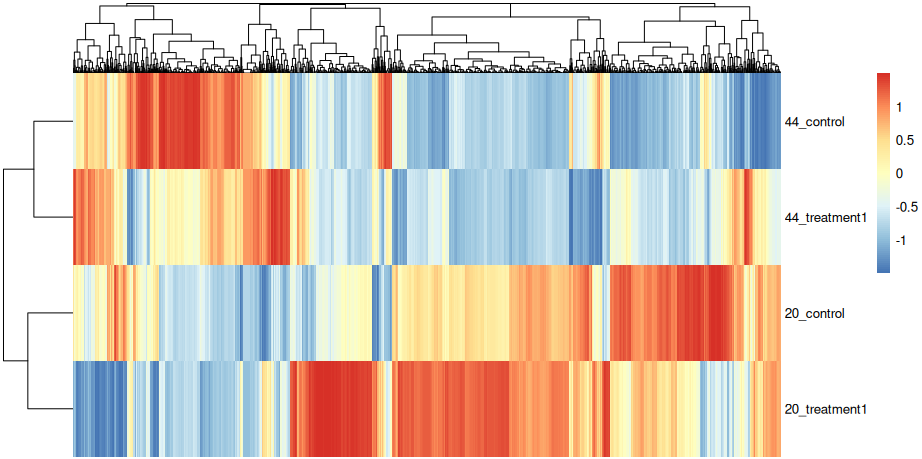

# ISF: RNA-seq Analysis of *Paenibacillus dendritiformis* under Surfactin Exposure

This document explains and runs the RNA-seq analysis for four conditions:

1. PD after 20h with surfactin  
2. PD after 20h without surfactin  
3. PD after 44h with surfactin  
4. PD after 44h without surfactin  

The goal:  
- Find differentially expressed (DE) genes.  
- Identify which **GO terms (biological functions)** are enriched.  
- Collapse expression data into **GO functions** and plot a **heatmap** to compare across conditions.  

---

## 🔹 Step 1. Setup and Load Data
Load counts (gene × sample table) and metadata (sample info).
```r
install.packages("ggplot2")   # for plotting
library(ggplot2)
library(clusterProfiler)      # for GO enrichment
library(DESeq2)               # for differential expression

# --- Setup ---
setwd("~/home/oreinish/RNA_seq/deseq2/dseq2_input/")

# --- Load counts ---
f_counts <- "/home/oreinish/RNA_seq/deseq2/dseq2_input/Counts.csv"
counts <- read.csv(f_counts, sep = ",", stringsAsFactors = FALSE, header = TRUE, row.names = 1)

# --- Load metadata ---
f_design <- "/home/oreinish/RNA_seq/deseq2/dseq2_input/metadata.csv"
design <- read.csv(f_design, sep = ",", stringsAsFactors = FALSE, header = TRUE, row.names = 1)

# --- Check alignment ---
colnames(counts)      # sample names in counts
rownames(design)      # sample names in metadata
all(colnames(counts) %in% rownames(design))  # should be TRUE
all(rownames(design) %in% colnames(counts))  # should be TRUE

# Fix sample name mismatches (remove leading "X" if present)
colnames(counts) <- sub("^X", "", colnames(counts))

# Ensure columns match metadata order
counts <- counts[, rownames(design)]
```

## 🔹 Step 2. Prepare Factors and Filter Genes
```R
# --- Convert to factors ---
colData <- design
colData$Treatment <- factor(colData$Treatment)
colData$TimePoint <- factor(colData$TimePoint)

# --- Filter low-count genes ---
keep <- rowSums(counts > 5) >= 3 & rowSums(counts) > 100
counts <- counts[keep, ]
```
## 🔹 Step 3. Differential Expression with DESeq2
```R
dds <- DESeqDataSetFromMatrix(
  countData = counts,
  colData = colData,
  design = ~ TimePoint * Treatment
)

# Relevel to set control as reference
dds$Treatment <- relevel(dds$Treatment, ref = "control")

# Variance-stabilizing transformation + PCA
vcd <- vst(dds, blind = FALSE)
plotPCA(vcd, intgroup = c("TimePoint", "Treatment"))

# Run DESeq2 analysis
dds <- DESeq(dds)
resultsNames(dds)  # list available comparisons
```
## 🔹 Step 4. GO Enrichment
We take significant DE genes and see which GO terms are overrepresented.
```R
library(readxl)
library(dplyr)
library(tibble)
library(clusterProfiler)
library(GO.db)

# --- Load DE genes ---
df <- read_excel("combined_deseq2_gtf_with_length.xlsx")
names(df)[names(df) == "GeneID"] <- "gene_id"
de_genes <- df$gene_id[df$significant == 1]

# --- Load GO mapping ---
go_map <- read_excel("/home/oreinish/Desktop/imag_for_github/goseq/goTerms.xlsx")
colnames(go_map) <- c("gene_id", "go_term")

# --- Build TERM2NAME ---
all_go_ids <- unique(go_map$go_term)
valid_go_ids <- all_go_ids[all_go_ids %in% keys(GO.db)]
go_terms <- Term(GOTERM[valid_go_ids])
go_names <- data.frame(go_term = names(go_terms),
                       name = unname(go_terms),
                       stringsAsFactors = FALSE)

# --- Run enrichment ---
ego <- enricher(
  gene = de_genes,
  TERM2GENE = go_map[, c("go_term", "gene_id")],
  TERM2NAME = go_names
)

# --- Filter significant GO terms ---
sig_GO <- ego@result %>%
  filter(p.adjust < 0.05)

# Save results
write.table(sig_GO, "clusterProfiler_GO_results.txt", sep = "\t", quote = FALSE, row.names = FALSE)

# --- Plot top 30 GO terms ---
top_GO <- sig_GO %>%
  arrange(p.adjust) %>%
  head(30)

ggplot(top_GO, aes(x = reorder(Description, -log10(p.adjust)),
                   y = -log10(p.adjust))) +
  geom_bar(stat = "identity", fill = "palegreen2") +
  coord_flip() +
  xlab("GO Terms") +
  ylab("-log10(Adjusted p-value)") +
  ggtitle("Top GO Terms Enrichment") +
  theme_minimal(base_size = 14) +
  theme(axis.text.y = element_text(size = 12))
```
## 🔹 Step 5. GO-Term Heatmap

Here we collapse expression to the GO term level instead of individual genes.
```r
library(DESeq2)
library(dplyr)
library(tibble)
library(tidyr)
library(pheatmap)
library(stringr)

# Step 0: Extract normalized counts
norm_counts <- counts(dds, normalized = TRUE)  
norm_counts <- as.data.frame(norm_counts) %>%
  rownames_to_column("gene_id")

# Step 1: Clean gene IDs
norm_counts <- norm_counts %>%
  mutate(gene_id_clean = str_extract(gene_id, "PDENDC454_[0-9]+"))

# Step 2: Join with GO mapping
counts_go <- norm_counts %>%
  inner_join(go_map, by = c("gene_id_clean" = "gene_id"))

# Step 3: Aggregate counts per GO term
go_counts_per_sample <- counts_go %>%
  group_by(go_term) %>%
  summarise(across(where(is.numeric), sum, na.rm = TRUE), .groups = "drop")

# Step 4: Average replicates per condition
colData <- colData %>%
  mutate(condition = paste0(TimePoint, "_", Treatment))

go_counts_long <- go_counts_per_sample %>%
  pivot_longer(-go_term, names_to = "sample", values_to = "count") %>%
  left_join(colData %>% rownames_to_column("sample"), by = "sample")

go_counts_avg <- go_counts_long %>%
  group_by(go_term, condition) %>%
  summarise(mean_count = mean(count), .groups = "drop")

# Step 5: Prepare matrix for heatmap
go_counts_avg_clean <- go_counts_avg %>%
  filter(!is.na(condition))

go_heatmap_table <- go_counts_avg_clean %>%
  pivot_wider(names_from = go_term, values_from = mean_count)

heatmap_matrix <- as.matrix(go_heatmap_table[,-1])
rownames(heatmap_matrix) <- go_heatmap_table$condition
heatmap_matrix[is.na(heatmap_matrix)] <- 0  # Replace NA with 0

# Step 6: Plot heatmap
pheatmap(heatmap_matrix,
         scale = "column",        # 🔑 Normalize each GO term to its own scale
         cluster_rows = TRUE,
         cluster_cols = TRUE,
         clustering_distance_rows = "euclidean",
         clustering_distance_cols = "euclidean",
         clustering_method = "complete")
```


