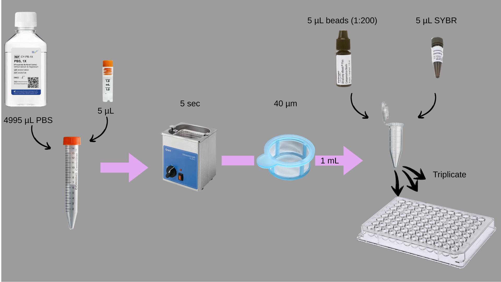

# FACS Sample Preparation and Analysis Protocol

## Overview
This protocol describes the preparation of bacterial samples treated with and without surfactin for fluorescence-activated cell sorting (FACS) analysis. Samples are taken from multiple time points, diluted, sonicated, filtered, and stained prior to loading onto a 96-well plate for FACS.

---

## Materials
- Frozen experimental samples (stored at -80 °C in 1 µL glutaraldehyde per 200 µL sample)
- Phosphate Buffered Saline (PBS)
- 15 mL Falcon tubes
- 1.5 mL Eppendorf tubes
- 40 µm cell strainers or filters
- FACS beads
- FACS Cyber Green stain (orange-colored)
- 96-well microplate
- Sonicator (28 kHz)
- Pipettes and sterile tips

---

## Procedure

### 1. Sample Dilution
1. Prepare 9 × 2 = 18 Falcon tubes (15 mL each) plus one additional tube for the LB control (total = 19 tubes).  
2. Into each Falcon tube, add **4995 µL PBS**.
3. Thaw the original frozen samples (200 µL + 1 µL glutaraldehyde) briefly on ice.
4. For each sample, transfer **5 µL** of the thawed material into the corresponding PBS tube to achieve a **1:1000 dilution**.

**Samples and conditions:**
- Time points: 0 h, 8 h, 16 h, 20 h, 24 h, 28 h, 34 h, 38 h, 42 h  
- Conditions: ± Surfactin  
- Control: LB medium (also preserved with glutaraldehyde)

---

### 2. Sonication
1. vortex 5 sec
2. Place all 19 Falcon tubes in a 28 kHz sonicator.
3. Sonicate each tube for **5 seconds** to disperse potential aggregates.

---

### 3. Filtration
1. Label **19 Eppendorf tubes (1.5 mL)**.
2. vortex 5 sec
3. Using a 40 µm filter, transfer **1 mL** from each 15 mL Falcon tube into its corresponding Eppendorf.
   - This step ensures removal of large aggregates or debris.

---

### 4. Staining and Bead Addition
1. To each Eppendorf tube, add:
   - **5 µL FACS beads**
   - **5 µL FACS Cyber Green stain**
2. Mix gently by pipetting.

---

### 5. Plate Loading
1. Using a 96-well plate, load **3 technical replicates** per sample:
   - Each well: **200 µL**
   - Total wells: 19 samples × 3 replicates = 57 wells.
2. Seal the plate and proceed with FACS analysis.

---

## Notes
- Keep all samples protected from light after staining.
- Perform FACS analysis as soon as possible after preparation.
- The LB control serves as a background reference for autofluorescence.

# FACS Sample Preparation and Analysis Protocol - take 2
In this protocol (which is the one we used in the end), we increased the amount of starting material (5 microliters is too little and every small mistake changes the result a lot), we used biological replicates rather than technical replicates, and we did not do sonication.

This experiment analyzes Paenibacillus dendritiformis grown with and without surfactin. Samples were collected at multiple time points, fixed with glutaraldehyde, and stored at –80 °C prior to FACS analysis.

## Overview of Samples

   * Original experiment: 81 tubes designated for FACS

      * 3 biological replicates × 3 treatments (with surfactin, without surfactin, LB control)

      * 9 sampling time points (each fixed and frozen)

   * Current FACS run:

      * Time points analyzed: 8, 16, 20, 24, 28, 34, 38, 42 hours
      * Treatments included: with surfactin, without surfactin
      * Additional controls: 3 LB negative control samples from 16 hr time pint
      * Total samples loaded: 51
      * Only biological replicates included (no technical replicates)

## 1. Sample Dilution
   a. First dilution (1:100)
   * Thaw samples stored at –80 °C.
   * Transfer 10 µL from each sample into an Eppendorf tube containing 990 µL PBS.
   * vortex for 5 seconds.

   b. Second dilution (1:10 of previous = 1:1000 total)

   * From the 1:100 dilution, transfer 100 µL into a new Eppendorf tube containing 900 µL PBS.
   * vortex for 5 seconds.

Result: 51 samples diluted 1:1000 in PBS.

## 2. Filtering (40 µm)

To prevent clogging or damaging the FACS instrument, all samples were filtered, even though the bacterial cells are significantly smaller than 40 µm.

* Pass each 1:1000 dilution through a 40 µm filter into a clean Eppendorf tube.

Result: 51 filtered, 1:1000 dilution samples.

## 3. Adding Beads and SYBR Green

* Add 5 µL of beads (pre-diluted 1:200).
* Add 5 µL of SYBR Green (pre-diluted 1:100).
* Mix gently and protect samples from light.

## 4. Loading into a 96-Well Plate

* Load one well per sample.
* Follow the plate layout shown below:

Workflow Summary

