# FlowJo Tutorial: From Raw FACS Data to Exported Table

This tutorial walks through how to process FACS (Flow Cytometry) data using **FlowJo**, from importing your files to exporting final tables to Excel.

---

## Step 1 – Open a New Workspace
1. Launch **FlowJo**.
2. Open a **new workspace** file.

---

## Step 2 – Import FACS Files
Drag your `.fcs` files from your FACS folder into the FlowJo workspace table.
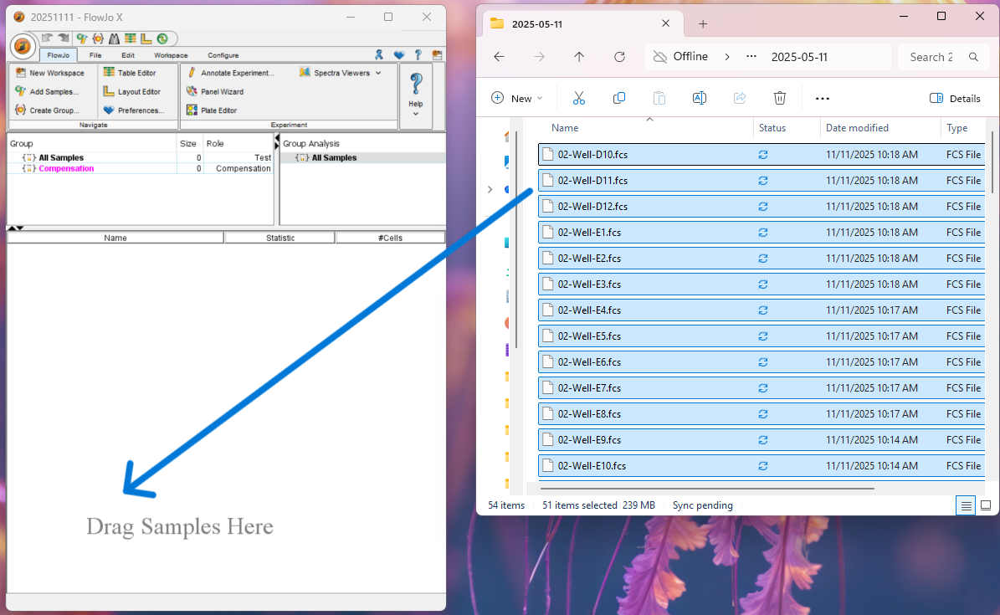

---

## Step 3 – Open a Blank Sample
Click on one of the **blank** samples in the workspace to open its plot.
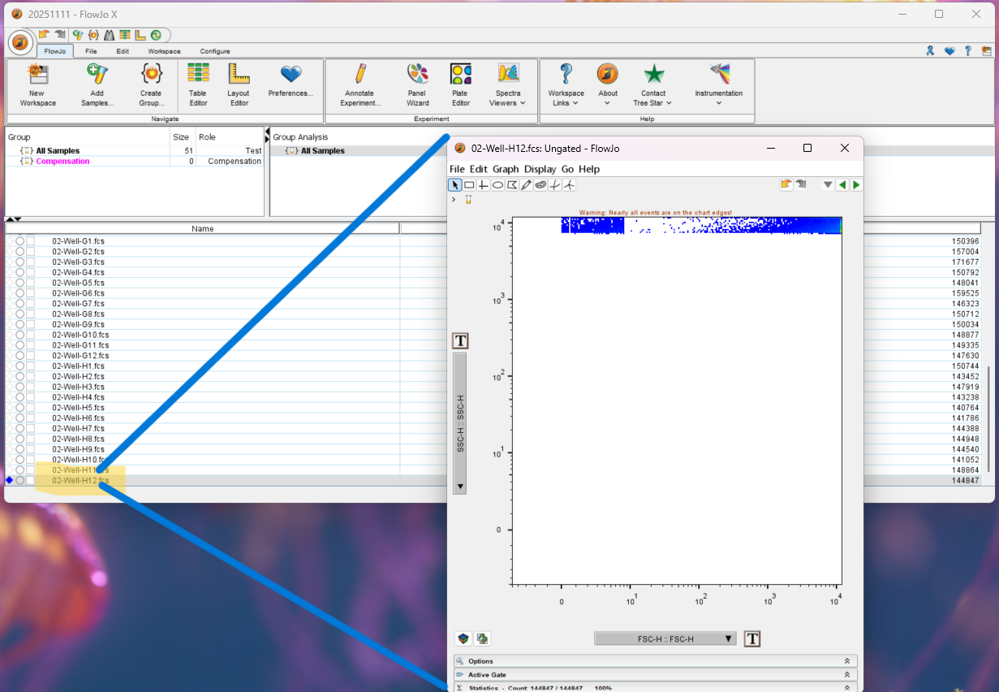
---

## Step 4 – Update Axes (Part A)
1. Press **`T`** to open the **Axes** window.
2. Choose a **logarithmic axis**.
3. Set the axes parameters:
   - **X axis:** `FSC-H` (Forward Scatter H)
   - **Y axis:** `SG B25 H` (Cyber Green)
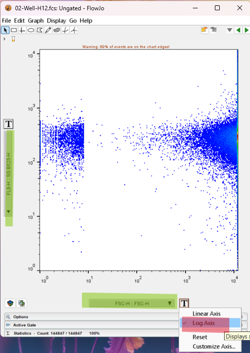
---

## Step 5 – Adjust Axes (Part B)
1. Press **`T`** again and select **Customize Axis**.
2. Use the **right arrows** to adjust the **X-axis scale** (e.g., to `10^7`).
3. Use the **left arrows** to position the peak on the **left side** of the graph.
4. Click **Apply** to confirm.
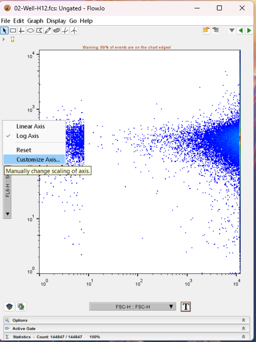
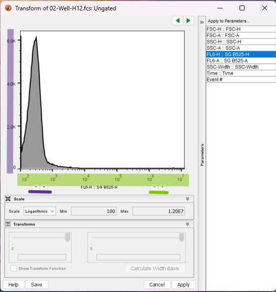
---

## Step 6 – Gate the Beads and Background
1. At this stage, we used a **blank sample** (without bacteria), so we are sopused to see only the bead cluster and the background cluster.
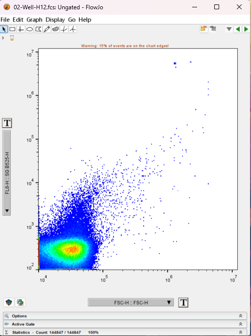
2. Identify and **gate** the **background** and **bead** populations.
3. Name the gates appropriately.
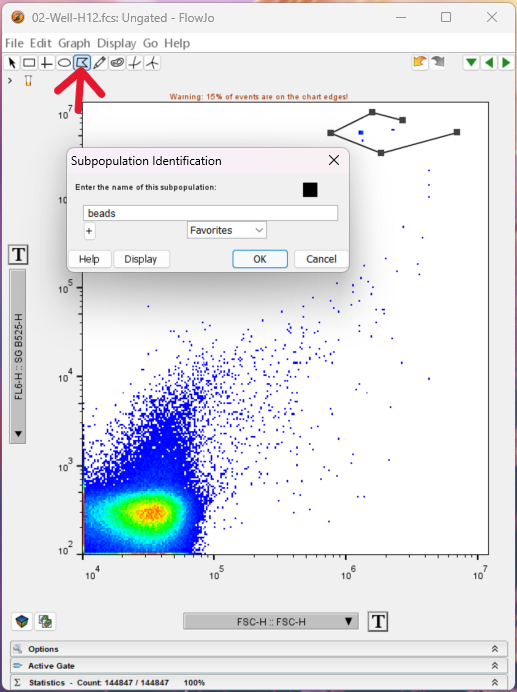
---

## Step 7 – Apply Gates to All Samples
1. In the workspace, drag the gates you created (background and beads) from your current sample onto **“All Samples”**.
2. This applies the gates to every sample automatically.

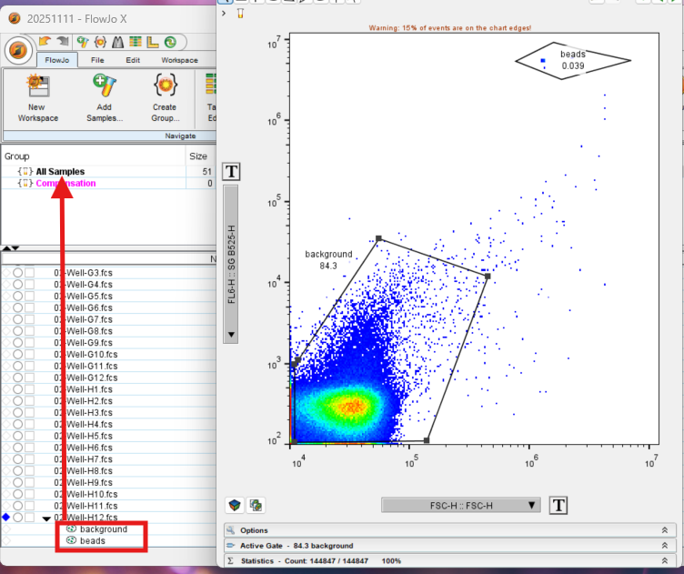

3. Use the **navigation arrows** at the top right of the plot window to cycle through samples and verify gate alignment.
4. If you adjust a gate, **drag it again to “All Samples”** to apply the changes globally.
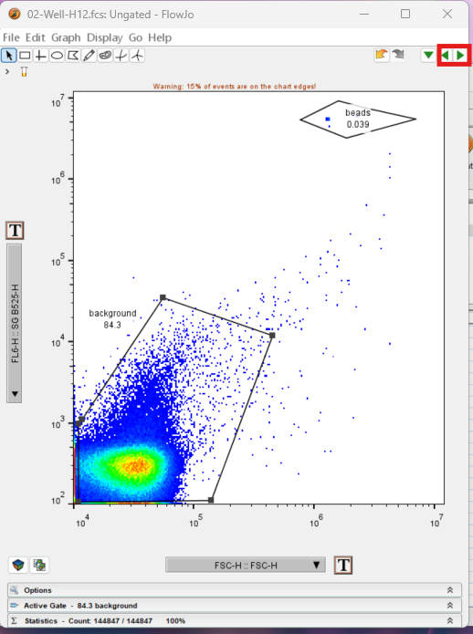
---

## Step 8 – Gate the Bacterial Groups
1. Open a **non-blank** (bacterial) sample.
2. Create and name gates for the **bacterial populations**.
3. Repeat the same process:
   - Gate and name the populations.
   - Apply to all samples.
   - Fine-tune as needed across samples.
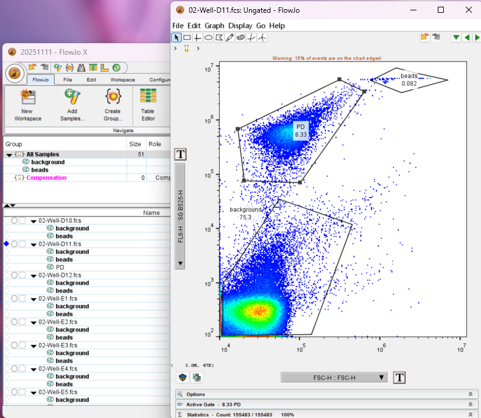
---

## Step 9 – Adjusting Gates and Saving Graphics
1. Select a sample and click on the gates in the workspace.
2. Adjust axes as described in **Step 4** (usually no need to re-customize scales).
3. Apply the updated gate to all samples by dragging it to **“All Samples”** again.
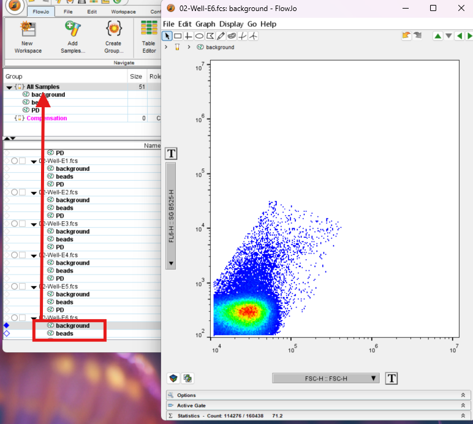

4. To **save images**, open the desired plot and go to:  
   `File → Save Graphic As...`
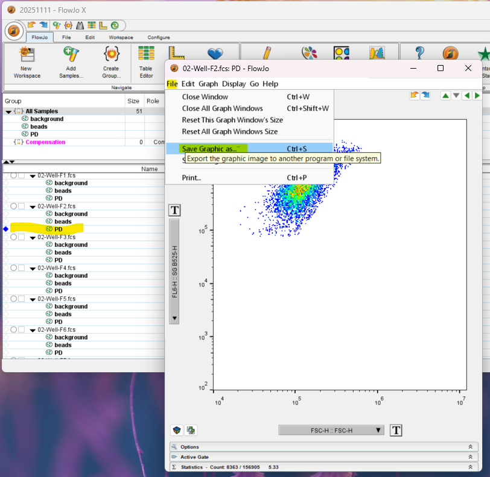
---

## Step 10 – Building a Table
1. Open the **Table Editor** (`Table Editor` button on the toolbar).
2. Go to **Edit → Add Column**.
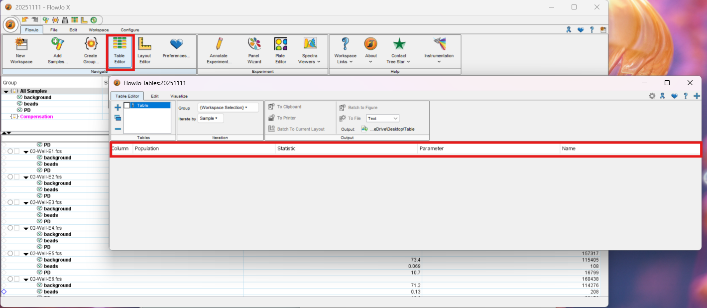
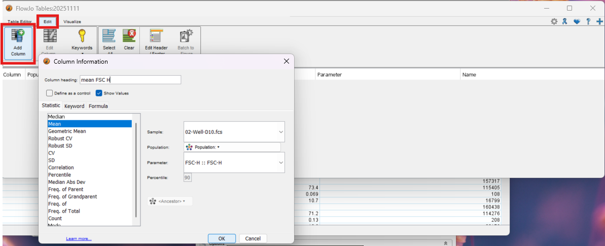
3. In the popup window, set:
   - **Sample:** Any (used only for reference)
   - **Population:** Select the gate of interest (e.g., bacterial group)
   - **Statistic:** Choose the type of calculation (e.g., `Mean`, `Median`, `Count`)
   - **Parameter:** Choose what to measure (e.g., `FSC`, `SSC`, `SG`)
4. Click **OK**.
5. Add as many columns as you need for your analysis.
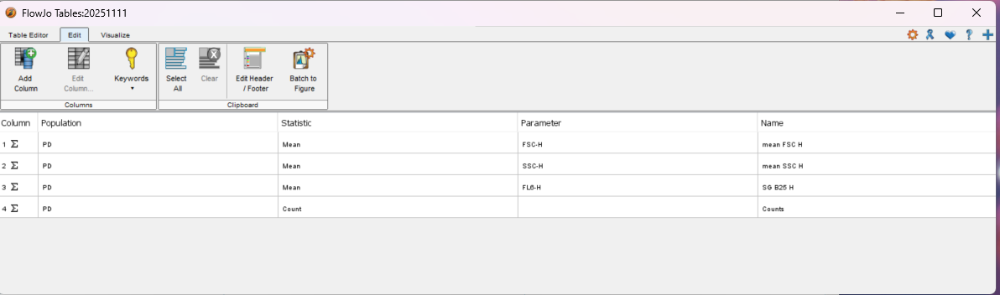
---

## Step 11 – Export to Excel
1. Click the **gear icon** in the Table Editor.
2. Select:  
   `Save As → Excel (.xlsx)`
   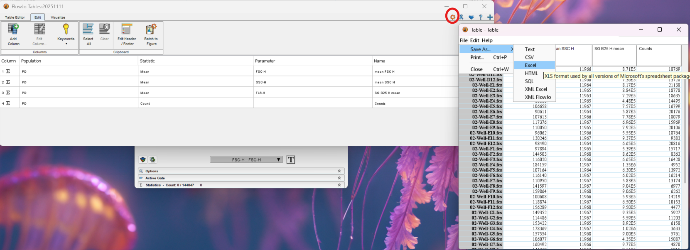
3. Choose a filename and location for your exported table.

---

✅ **You now have a complete FlowJo table exported to Excel**, ready for downstream analysis (e.g., R, Python, or Prism).

---

### Notes
- Ensure gate names are **consistent** across samples.
- Always verify gate placement visually on several representative samples.
- Save your workspace frequently to avoid losing progress.
