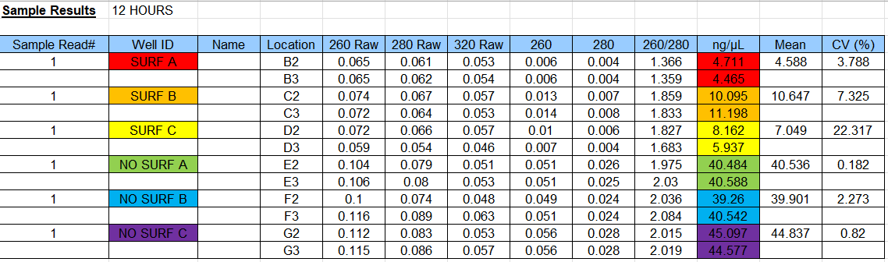
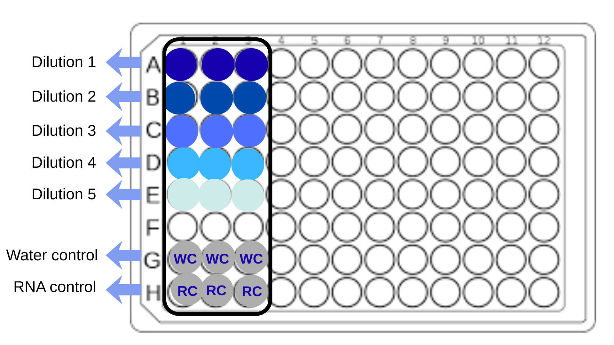
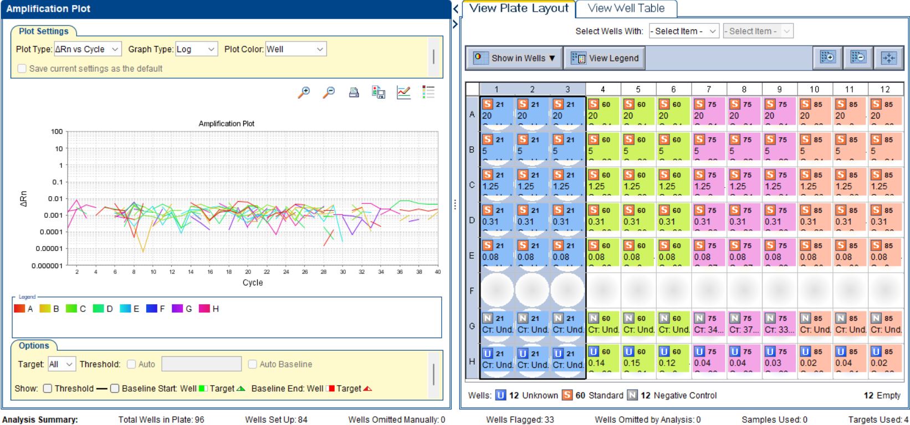
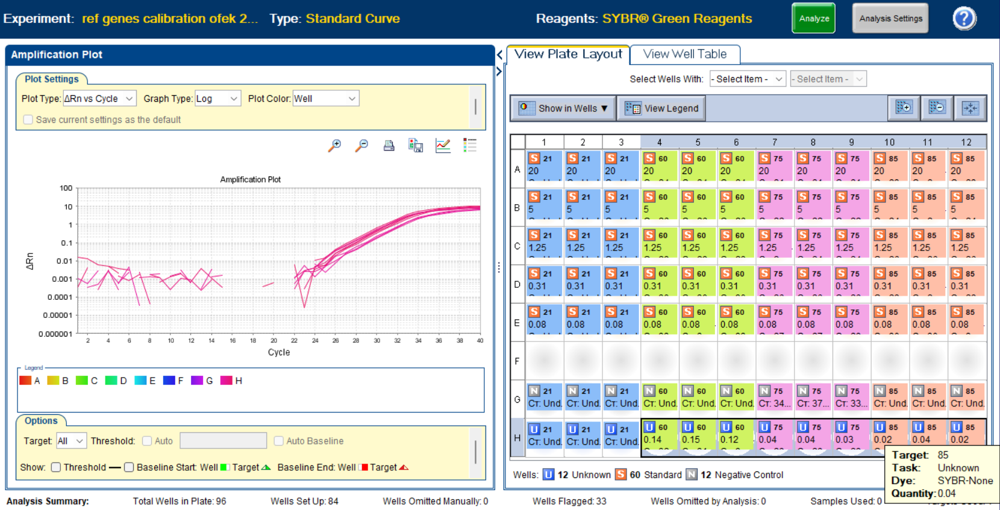
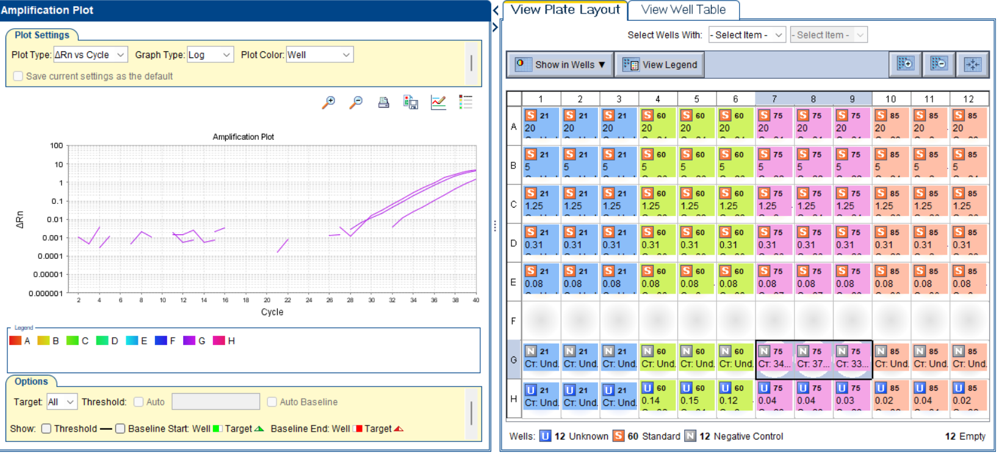
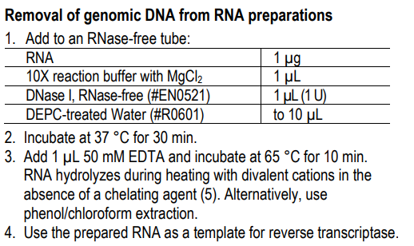
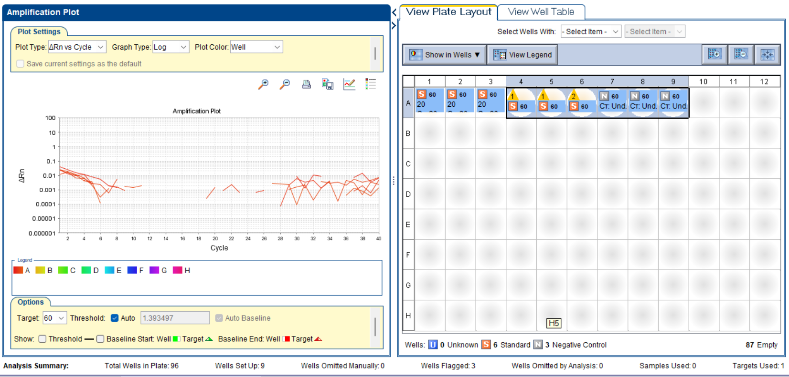

## qPCR Primer Calibration and Efficiency Testing
In order for a gene to be considered a good reference (/normalizing) gene, it has to pass two tests:
1. the efficiency of the primers should the same, or very close to the efficiency of the GOI (the Genes Of Intrest) we are checking.
2. It should show no difference in fold change between control and treatment.

first we will be checking the efficiency of the primers. 

The perpous of this post is to show how to condact and efficiency (E) calibration test usong qPCR. To demonstrate the process i checked the efficency of 4 genes who are candidates to be reference genes.

### RNA Extraction and Quality Control

Total RNA was extracted using the **NucleoSpin® RNA Stool kit** (Macherey-Nagel), according to the manufacturer’s instructions  
([link to kit](../_posts/2024-07-24-RNA%20Extraction%20Protocol.md)).

RNA concentration and purity were assessed using a **NanoDrop spectrophotometer**. The obtained absorbance ratios (A260/280 and A260/230) indicated acceptable RNA quality for downstream applications.

* [Link to excel file](../exel%20files/qPCR/12hr_ref_genes_rna_concentration_nanoPore.xlsx)

Important: this is only rna concentration. the rna was then converted to cDNA, where it was further diluted. In *our case*, we wanted to reach a final concentration of **20 ng/µL**. So we added 10µL into the cDNA reaction tude (in the concentration of ~40 ng/µL of NO surf C). 

[RNA to cDNA protocol](../pdf%20protocols%20and%20papers/PB30.11-UltraScript-cDNA-Synthesis-Kit-Manual.pdf)

Remember, since we are just calibrating, it dosnt matter on wich template we check primer efficency, so we chose to work with this high concentration. 

---

### Objective

This experiment was designed to evaluate the performance and suitability of selected primer pairs for use as **normalization (reference) genes** in quantitative PCR (qPCR), by generating a calibration (standard) curve.

---

### qPCR Reaction Setup

For each primer pair, a **general reaction mix** was prepared containing:

- Fast SYBR™ Green Master Mix  
- Forward primer  
- Reverse primer  
- Nuclease-free water  

Note: the final concentration of the primers in the well should be 0.2µM. this means that the concentration in the tube should be 2µM (since it goes into a 10µL reaction tube). Therefore, if starting from a 100µM primer concentration (original tube), we have to fitst dilute x50 to get to 2µM.

Each qPCR reaction well contained a total volume of **10 µL**, composed of:

| Component          | Volume per well (µL) |
|--------------------|----------------------|
| Fast SYBR Green    | 5.0                  |
| Forward primer     | 1.0                  |
| Reverse primer     | 1.0                  |
| Template           | 1.0                  |
| Nuclease-free water| 2.0                  |
| **Total**          | **10.0**             |

---

### Preparation of Master Mix

All reactions were performed in **technical triplicates**.  
For each primer pair, a total of **21 wells** were required:

- 5 template dilutions × 3 replicates = 15 wells  
- No-template control (NTC) × 3 replicates  
- No–reverse transcription control (No-RT) × 3 replicates  

To account for pipetting error, a master mix sufficient for **25 reactions** was prepared.

**Master mix composition:**

| Component          | Total volume (µL) |
|--------------------|-------------------|
| Fast SYBR Green    | 125               |
| Forward primer     | 25                |
| Reverse primer     | 25                |
| Nuclease-free water| 50                |

A volume of **9 µL** of the master mix was dispensed into each well, followed by **1 µL** of the appropriate template or control.

---

### Template Dilution Series

A serial dilution of cDNA was prepared starting from an initial concentration of **20 ng/µL**, using a 1:4 dilution factor.  
This resulted in the following five template concentrations:

- 20 ng/µL  
- 5 ng/µL  
- 1.25 ng/µL  
- 0.3125 ng/µL  
- 0.078125 ng/µL  

---

### Controls

Two types of negative controls were included:

- **No-template control (NTC):** nuclease-free water substituted for template  
- **No-RT control:** RNA sample that was not reverse-transcribed into cDNA  

These controls were included to assess contamination and genomic DNA carryover, respectively.

---

### Plate Layout

The qPCR plate layout was designed to include all dilutions and controls in triplicate.

---

### qPCR oneStep parameters

### Results
As noted, in this example we looked at 4 genes that we thought would be good normalizing genes:
- PDENDC454_05621 (ftsZ)
- PDENDC454_09860 (rpoB)
- PDENDC454_09875 (rpsL)
- PDENDC454_09885 (translation elongation factor G normalizing gene)

First I ran a regular PCR to make sure the primers were binding (in the PDENDC454_05621 gene I mistakenly loaded on the ladder):

Once I saw that they were binding I ran a qPCR as described above.
The results showed three important things:
1. I have a genomic DNA contamination.
2. The primers for PDENDC454_09875 are probably also contaminated
3. The primers for PDENDC454_05621, although they showed good binding in the PCR, do not bind here.

in the images:
- PDENDC454_05621 = 21
- PDENDC454_09860 = 60
- PDENDC454_09875 = 75
- PDENDC454_09885 = 85

So I cleaned my RNA with DNase from the Thermo scientific kit:
DNase I, RNase-free
Pub. No. MAN0012000
Rev. Date 05 April 2016 (Rev. B.00)

According to the following incubation:

Then I switched back to cDNA and ran another qPCR on NO surf C and with the primers for PDENDC454_09860 (rpoB).

You can see that the treatment worked and the genomic DNA is gone (the wells of the rna control are the ones marked with yellow triangles, follwed by three negative control wells).
* Note that this will likely affect the concentration - in the future, RNA concentration should be checked after the DNase incubation.

## DNase Treatment of RNA Samples and Validation

Since DNase-based purification appeared effective in removing genomic DNA contamination, the remaining RNA samples were treated accordingly. These included samples A and B grown without surfactin, and samples A, B, and C grown with surfactin. Following DNase treatment, RNA concentrations were measured using a NanoDrop spectrophotometer prior to cDNA synthesis. The measured concentrations were slightly lower to those obtained in the initial RNA extraction.

The DNase purification protocol nominally requires 1 µg of RNA per reaction. However, for several samples this amount could not be reached even when using the entire available RNA volume. Therefore, DNase reactions were scaled according to the available RNA volume while maintaining appropriate buffer and enzyme ratios.

### DNase Treatment Setup

- **Sample A (+ surfactin):**  
  100 µL RNA, 0.5 µL DNase I, 10 µL 10× reaction buffer, no added water.  
  After the first incubation, 11 µL EDTA was added.

- **Sample B (+ surfactin):**  
  100 µL RNA, 1 µL DNase I, 10 µL 10× reaction buffer, no added water.  
  After the first incubation, 11 µL EDTA was added.

- **Sample C (+ surfactin):**  
  100 µL RNA, 0.8 µL DNase I, 10 µL 10× reaction buffer, no added water.  
  After the first incubation, 11 µL EDTA was added.

- **Sample A (– surfactin):**  
  25 µL RNA, 1 µL DNase I, 3 µL 10× reaction buffer, no added water.  
  After the first incubation, 3 µL EDTA was added.

- **Sample B (– surfactin):**  
  100 µL RNA, 1 µL DNase I, 3 µL 10× reaction buffer, no added water.  
  After the first incubation, 3 µL EDTA was added.

### Validation of DNase Treatment

Following DNase treatment, a standard PCR was performed to assess residual genomic DNA contamination. The PCR included:
- RNA samples as templates (–RT controls),
- a water-only negative control,
- a previously tested qPCR-positive cDNA sample (NO SURF C) as a positive control,
- and an RNA control known not to produce amplification (NO SURF C).

The PCR results showed no unexpected amplification in the RNA or water controls, suggesting effective removal of genomic DNA. Nevertheless, the samples were also subjected to qPCR analysis, which provides higher sensitivity for detecting low-level contamination.

