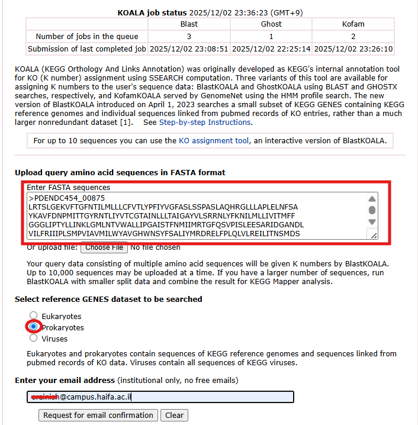
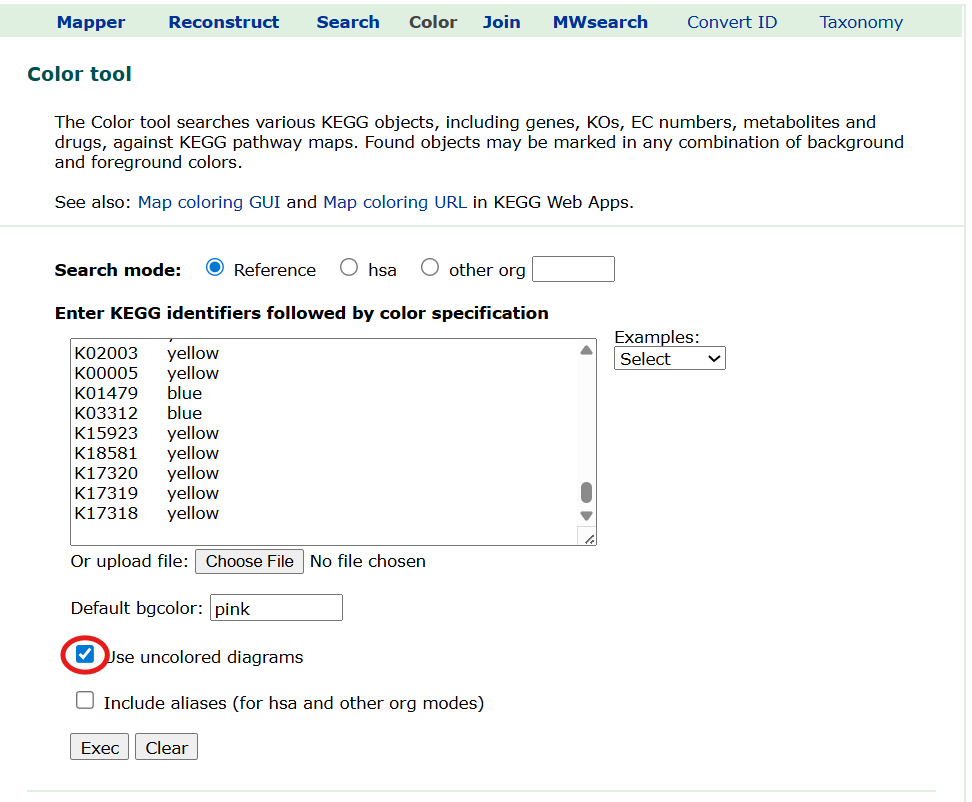

# Guide: Annotating Metabolic Pathways Using blastKOALA and KEGG Mapper (Color)

This guide explains how to obtain **KO terms** for your organism using **blastKOALA**, prepare the data for **KEGG Mapper (Color)**, and visualize metabolic pathways with expression-based color coding.

---

## 1. Obtaining KO Terms Using blastKOALA

1. Go to the [blastKOALA](https://www.kegg.jp/blastkoala/) website:  
   
2. Paste your **amino acid sequences** into the input window.

3. Under *taxonomy group*, select **Prokaryotes**.

4. Enter your **university email address**.

5. Submit the job.

6. You will receive an email from KEGG.  
   Click **Submit** to confirm.

7. When the analysis is complete, you will receive a second email.  
   Click the link to access your results.

8. Download the results file and open it in Excel.

**Important:**  
Send **all genes** from your genome/proteome, *not just DEGs*.  
KEGG Mapper requires a complete set of KO annotations to properly mark pathways.

---

## 2. Preparing the Input Table for KEGG Mapper (Color)

1. Open the blastKOALA results file in Excel.

2. Prepare a table with **three columns**:

   - **Column 1:** Gene name  
   - **Column 2:** KO term (format: `Kxxxxx`)  
   - **Column 3:** Color code

3. Choose colors based on your gene expression results.  
   For example, for the 20-hour comparison:

   - **Red** – Upregulated  
   - **Blue** – Downregulated  
   - **Yellow** – Genes that have a KO term but are not differentially expressed

4. Save the file or keep it open for copying.

---

## 3. Running KEGG Mapper (Color)

1. Search for **"KEGG Mapper"** in Google.

2. Click [KEGG Mapper – Color](https://www.genome.jp/kegg/mapper/color.html):  

3. Copy **Columns 2 and 3** (KO term + color) from your Excel file.

4. Paste them into the input box in KEGG Mapper (Color).

5. Check the box:  
   **"Use uncolored diagrams"**

6. Click **EXEC**.

7. KEGG Mapper will generate a list of metabolic pathways.  
   Each pathway diagram will display your selected **color codes** directly on the enzymes.

---

## 4. Interpreting the Pathways

- Look for **clusters**, not isolated colored enzymes.  
- Patterns such as:
  - Entire pathways turning blue or red  
  - Sequential genes in a pathway showing coordinated expression  
  - A group of connected reactions with consistent color trends  

These patterns usually indicate a biologically meaningful response.

*(Place for pictures)*

---

## Notes and Tips

- **blastKOALA assigns only one KO per gene.**  
  A gene may participate in multiple pathways, but KOALA assigns the *primary* function.  
  For expanded mapping, consider tools like **Galaxy** or **eggNOG mapper**.

- **This method is not KEGG enrichment.**  
  We are not calculating statistical enrichment.  
  Instead, we are overlaying expression data onto KEGG maps to visually identify:
  - Upregulated modules  
  - Downregulated modules  
  - Pathway-level expression trends

This visual inspection can reveal important biological insights even without enrichment statistics.

---

If you'd like, I can also create a **flowchart**, **image placeholders**, or **example Excel templates** to accompany the guide.
