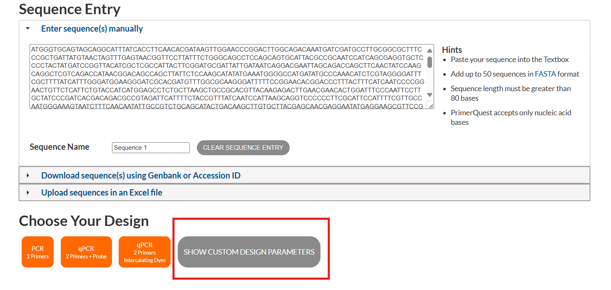
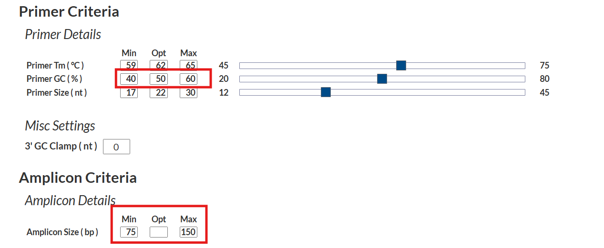
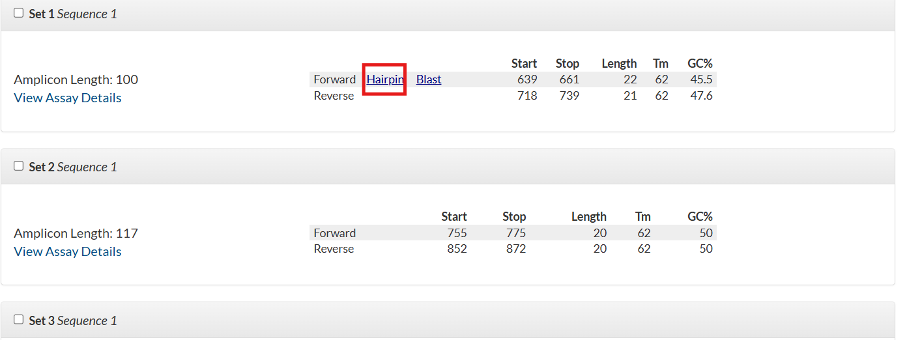
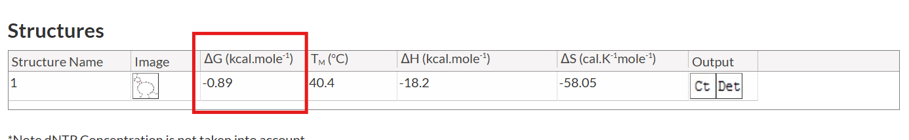
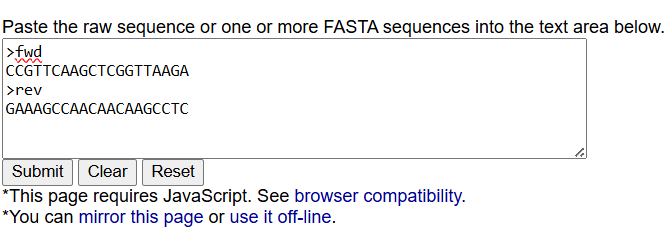
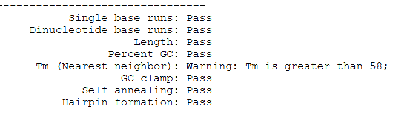
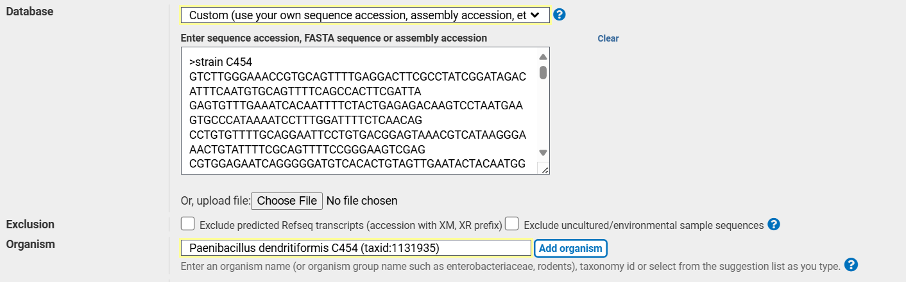

# qPCR Primer Design

## Materials and Tools:
1. Gene sequence of interest
2. IDT (Integrated DNA Technologies) PrimerQuest Tool 
3. "PCR Primer Stats" Tool 
4. Primer-BLAST Tool 
5. Custom FASTA database of the target genome (from NCBI)
## Procedure

Once obtaining Gene Sequence:

### Design Initial Primers Using IDT PrimerQuest Tool

1. Go to the IDT PrimerQuest Tool. [IDT PrimerQuest link](https://eu.idtdna.com/pages/tools/primerquest?returnurl=%2FPrimerQuest%2FHome%2FIndex).
2. Input the gene sequence into the tool.
3. select "Custom Design Parameters": 
- select "qPCR Primers Only (no probes)".
- Set the GC content parameter to be between 40-60%.
- Define the desired replicon length (amplicon length) to be between 75-150 base pairs (bp).

4. Evaluate Primer Hairpin Stability

- For each pair of primers generated, click on the "Hairpin" option in the IDT tool.

- Examine the delta G (ΔG) values of the hairpin structures. Select primers with the lowest delta G values (close to -1 or more negative), indicating minimal secondary structure formation.

- Optionally, you can mix and match forward and reverse primers from different pairs if they maintain a replicon length between 75-150 bp and have low delta G values.

### Validate Primer Characteristics Using "PCR Primer Stats" Tool

1. Input the selected primer sequences into the PCR Primer Stats Tool. [PCR Primer Stats link](https://www.bioinformatics.org/sms2/pcr_primer_stats.html).

2. Ensure that all parameters such as GC content and primer length are within acceptable ranges ("pass").
If any parameter is out of range, adjust the primer sequences. You can shorten or extend the primers while ensuring they meet the replicon length criteria.
 - Note that the Tm parameter warns you if it higher than 58c, it's OK, tm can be up to 65c.

3. If necceray, re-run the adjusted primers in the "PCR Primer Stats Tool" until they all pass the required checks.

### Check Primer Specificity Using Primer-BLAST

 1. Go to the Primer-BLAST tool. [Primer Blast link](https://www.ncbi.nlm.nih.gov/tools/primer-blast/index.cgi?LINK_LOC=reset).
2. Enter the final selected primer sequences into the tool under "Primer Parameters".

3. Choose the following settings:
 - "Database": Select "Custom" and upload the FASTA file of the whole genome for the target organism.
 - "Organism": choose your organizm.

4. Run Primer-BLAST and review the results to ensure:
- The expected length of the amplicon (replicon) matches the expected lenght.
- The primers do not produce non-specific amplification within the target genome.
- The first match in Primer-BLAST has 100% alignment to your primers.

